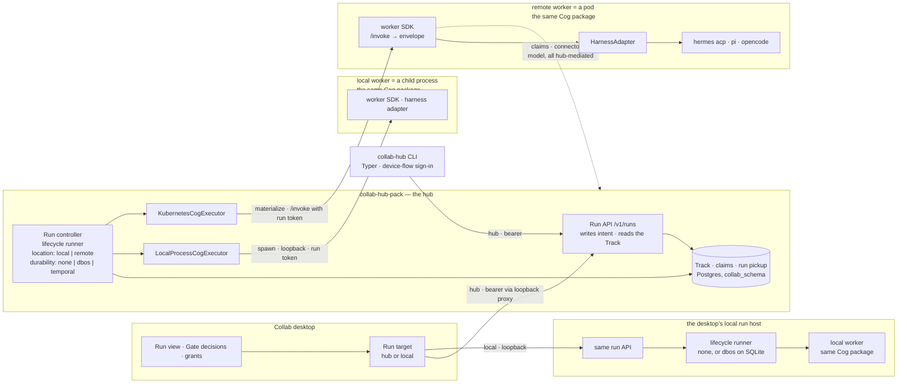
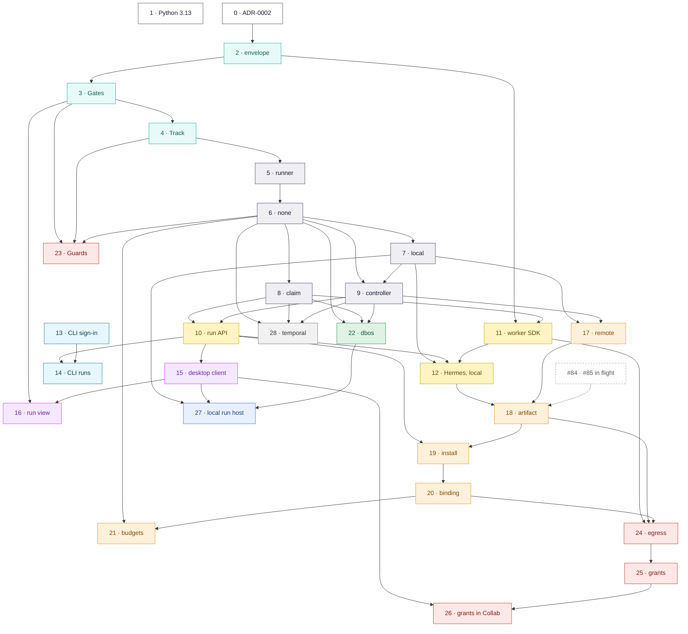

# Cog execution: the plan

How Cog execution lands in this hub, one pull request at a time. Every phase below is an issue — in this repository for the hub, in the Collab desktop repository for the desktop — and its status is kept current here as branches move. Comment on this document through its pull request; a decision that changes it is recorded in [§10](#10-decisions) and, when it is expensive to reverse, in [ADR-0002](docs/adr/0002-lifecycle-runner-durability-and-placement.md).

**Origin.** The program's parent issue is apollo-desktop#690, *Cog execution in the hub*; its children are #1–#9 here and apollo-desktop#719, and the first prototype (#20, PR #23) was superseded by #35. The brief behind it: Cog execution in this hub, with local execution too, both launched by the Collab desktop; `none`, `dbos` and `temporal` as durability backends, `none` first; Hermes ([site](https://hermes-agent.nousresearch.com), [docs](https://hermes-agent.nousresearch.com/docs), [source](https://github.com/NousResearch/hermes-agent)) as the first harness, with any other supported; the [glossary](docs/GLOSSARY.md) and [`docs/cog-execution/`](docs/cog-execution/README.md) as the vocabulary.

The requirements are the issues *and their comment threads*. The threads matter: most carry review from ADR-0001's author that narrows or corrects the issue body (who decides a pause, who re-drives a run, install versus materialize, the Cog's own `resolve`, no credential in the worker). Where the two disagree, this plan follows the comment.

## 1. Goals

The hub runs **Cogs** — packaged AI workers — and **Ops** — supervised, multi-step workflows over them — and Collab, the desktop client, launches, watches and decides them. Cog execution by the hub will support:

- **Two locations.** A worker runs as **`local`** — a child process of the run controller, on the same OS — or **`remote`** — a Kubernetes pod. Same runner, same Cog, one configuration value; `local` first.
- **Three durability backends.** **`none`** (no durability engine), **`dbos`** and **`temporal`**, behind one seam. **The priority is `none`**: it ships first, `dbos` is the next brought to a full implementation, `temporal` comes last.
- **Any harness.** The hub never learns which agent harness a Cog uses. **Hermes** is the first harness Cog; **pi** and **OpenCode** follow, and any harness that speaks ACP wraps with the adapter Hermes uses. Supporting a new harness is an adapter in the worker SDK, never a change to the hub.
- **Launched from Collab, and from a terminal.** The desktop submits a run, watches its Track, decides its Gates and grants connector access — on the hub first, and later on the user's own machine, through the same run API. The `collab-hub` CLI drives the same endpoints, so every feature is scriptable from the day it exists.
- **Accountable and bounded.** Every run has a Track that names what produced each result and who signed it. Gates are declared on Op steps and decided by people. Budgets, least-privilege workloads and egress restriction hold the trust boundary.

The first thing that runs end to end is the primary goal: **the hub launches Hermes as a separate local process and an Op step completes with a valid envelope**, on a laptop, with no cluster. The same abstraction then launches the same Cog in a pod, then `dbos` makes runs survive a restart, then `temporal`.

## 2. Requirements

| Requirement | What it means here | Where |
|---|---|---|
| Harness-agnostic | The hub speaks only the seam (a task entry point, the result envelope, a health probe, a catalog card). Hermes first; pi, OpenCode and any ACP harness next, each an adapter in the worker SDK. | Phases 11, 12; [§4](#4-target-architecture) |
| Agent location: `local` and `remote` | `location: local \| remote` selects the executor: a child process on the controller's host, or a pod. Chosen by configuration, like the durability backend. | Phases 7, 17 |
| Durability: `none`, `dbos`, `temporal` — in that order | One lifecycle runner; a backend decides only scheduling and checkpointing. `none` marks in-flight runs `interrupted` after a restart and never resumes them. | Phases 6, 22, 28 |
| Launched from Collab | The desktop drives runs on the hub, then on the user's machine, through one run API served by two hosts. | Phases 10, 15, 16, 27 |
| Scriptable from a terminal | A `collab-hub` CLI on Typer, authentication first, then a command per run-API endpoint; each later phase adds its own commands. | Phases 13, 14 |
| Runnable from `dev/`, asserted in CI, in the same PR | Every phase adds its `make` target at the lowest level that can host it, documents it, and asserts its contract in CI at that level. | [§5](#5-the-dev-environment-and-the-docs-carry-every-phase) |
| Documented in the same PR | Every phase updates the documents it makes stale, names them in the PR, and adds its terms to the glossary. | [§5](#5-the-dev-environment-and-the-docs-carry-every-phase) |
| Python 3.13 and 3.14 | The API supports both and CI tests both; the execution package, the worker SDK and the CLI support 3.11 and up. A Cog pins its own interpreter. | Phase 1 (done) |

## 3. Where we start

**Landed**

- **#94** — the local development environment in `dev/`: four levels (`make api` with no containers; `make api-pg` with Postgres and MinIO; `make api-oidc` with Keycloak, plus `api-fakes`, `api-full`, `api-membership`; `make kind-up` for the chart), fake Google, Slack and GitHub providers, a `nebari` realm, `seed-org` for owner and operator grants, and a single-port front door so Collab signs in at `http://localhost:9080` (`make api-desktop`). `dev-env.yaml` runs level 1 on Linux and macOS, levels 2–3 on Linux, and level 4 rendered only.
- **#35** — the standalone `execution/` distribution `collab-hub-execution` (Python ≥ 3.11, depends only on `httpx`): `WorkflowEngine` and the reference `DurableWorkflowEngine`, which recovers from the Track when a caller resubmits; `CogExecutor` with in-memory and Kubernetes implementations (a per-run Deployment + Service + ingress-only NetworkPolicy, no ServiceAccount token on workers); `TrackStore` with in-memory and Postgres adapters; `CogLifecycle`, `RunBudget`; `DeclaredCapabilityResolver`; a kind E2E running a gated two-step Op (`test-execution.yaml`, `test-execution-e2e.yaml`).
- **#111** and **#112** — Phases 0 and 1: the API runs on Python 3.13 with a CI job proving it, and ADR-0002 records the decisions the phases below depend on. **#115** moved the dev MinIO images to quay.io on the way.
- **#120** — Phase 2: `CogWorker.interact` returns the result envelope, which the engine reads everywhere it read `{output, usage}`. `ok: false` with an `error.code` fails the step and keeps the code; `ok: true` with `problems` completes it and records them for a Gate. The envelope's invariants hold on construction as on parsing, and the worker client maps the document's HTTP statuses. `InteractionResult` is gone.
- **#81, #82, #83** — the Cog bundle reader, the OCI client and the registry sources (PRs #89, #88, #90).
- **#23** — superseded; #20 was closed in favour of #2–#5.

**In flight — not this plan's to build**

- **#7** is decomposed into **#81–#87**. #84 (catalog store), #85 (catalog read API), #86 (webhooks) and #87 (config, PR #118) are open. Phase 18 consumes #84/#85; Phase 7 needs none of them, since it reads a package from a directory through a source of its own.
- **#78** moves the profile manifest into `pixi.toml` under `[tool.cog]`.

**Gaps between #35 and the requirements** — nearly all named in review on the issues:

| Today (#35) | Required | Source |
|---|---|---|
| ~~Worker answers `{output, usage}`~~ — *the envelope landed in #120; `{"pause": true}` is still how a Cog pauses* | The result envelope; the **step's Gate** decides a pause, never the Cog | #2 comment, seam note |
| One engine, durable only through Track replay a caller triggers | One **lifecycle runner**, with the durability engine absent (`none`) or plugged in (`dbos`, `temporal`) | #2 |
| The executor is whichever class the caller constructs, and the only real one needs a cluster | An **agent location**, `local` or `remote`, chosen by configuration like the backend — and `local`, a child process, first | this plan |
| At-least-once across pod replacement | A keyed claim, so a re-invoked step never repeats a side effect | #1 comment |
| A step event's payload is the raw output; a failure is a class name | Binding identity per step, actor per gate decision, bounded failure records | #5 comment |
| The Postgres Track creates its own tables | Hub tables through the `collab_schema` migration registry | #84, #42 |
| The hub's resolver selects the model; the worker only ever gets `COG_ID` | Hub offers inventory, the Cog's `resolve` selects, hub records **and delivers** the binding | #3 comment |
| A baked runner image | The installed Cog package running its own `serve` entry point | #1 comment |
| `collab_hub_api` does not import `collab_hub_execution` | A run controller and a run API | #1 |
| Nothing in the desktop calls a run API | Launch, watch and decide from Collab | apollo-desktop#690, #719 |
| The hub has no model configuration | A minimal `models:` block, generalized by the inventory later | this plan |

**Facts that constrain the design** — verified, not assumed:

- **Hermes and the hub share a Python, and still not an interpreter.** `hermes-agent` requires `>=3.11,<3.14`; the API requires `>=3.13`. The harness still lives in its Cog's own environment — ADR-0001 D2 and the seam put it there, and a Cog pins its own interpreter whatever the hub runs.
- **Collab already drives Hermes over ACP**, headlessly configured, in its own environment (Python 3.13, `hermes-agent` 0.17 with the `acp` and `mcp` extras), with tools sandboxed in Docker. Known hazard: Hermes 0.17's ACP adapter reports a failed turn as `stopReason: end_turn`.
- **The desktop has a local Python host** above the execution package's floor, and already models local-versus-remote placement for what it runs.
- **Both durability engines support every Python the hub does.** DBOS 2.31 and temporalio 1.32 require `>=3.10` and list 3.13 and 3.14.
- **DBOS can checkpoint to SQLite**, so a desktop can run durably without Postgres. Temporal needs a Temporal service and cannot.
- **DBOS creates its own databases** on Postgres when they are missing, so its role needs `CREATEDB` or the databases must exist first.
- **The hub has no model configuration.** The only `llm` in `config.py` and the chart is a Keycloak group path; #35's resolver takes a model inventory as an argument and nothing builds one. The first Hermes run needs a minimal `models:` block (Phase 9), which Phase 20's inventory later generalizes.
- **A local worker needs nothing #35 lacks.** `CogExecutor` is already a protocol with an in-memory implementation, and the seam is HTTP on a port: to the runner, a child process on loopback is indistinguishable from a pod.

## 4. Target architecture

**The seams.** Every requirement lands behind one of these, which is what keeps ADR-0001 invariants 2 and 5 true as implementations multiply:

| Seam | Contract | Implementations in this plan |
|---|---|---|
| Durability | `DurabilityBackend` under the lifecycle runner, plus two conformance suites | `none` (Phase 6), `dbos` (Phase 22), `temporal` (Phase 28) |
| Location | `location`, `local` or `remote`, selecting a `CogExecutor`; plus the location conformance suite | `local`, a child process (Phase 7); `remote`, a pod (Phase 17; from its artifact in Phase 18); in-memory (tests) |
| Track | `TrackStore` + the Track conformance suite | Postgres via migrations, SQLite, in-memory (Phase 4) |
| Resolution | hub inventory → the Cog's `resolve` → binding record | Phase 20 |
| Harness | `HarnessAdapter` inside the worker SDK | ACP (Phase 11) → Hermes (Phase 12), then pi and OpenCode; an OpenAI-compatible direct call (Phase 11) |
| Placement | one run API served by two hosts; the desktop's run target | hub (Phases 10, 15), local (Phase 27) |

### The lifecycle runner and its durability

There is **one component that runs a Cog's lifecycle** — the lifecycle runner. It owns the lifecycle, written once: resolve → materialize → ready → interact → read the envelope → Guards → Gate → idle or teardown, with budgets, cancellation and Track recording, all as plain step functions.

A **durability backend** decides only two things: how those step functions are scheduled, and whether progress between them is checkpointed.

- **`none`** — no durability engine. The runner calls the step functions directly, in process.
- **`dbos`** — the same step functions, run as the steps of a DBOS workflow.
- **`temporal`** — the same step functions, run as activities of a Temporal workflow.

No lifecycle logic lives inside a backend. That is ADR-0001 invariant 1 carried one level down — one lifecycle, never divergent code paths — and a test enforces that all three backends call the same step functions.

| | `none` | `dbos` | `temporal` |
|---|---|---|---|
| Durability engine | none | DBOS | Temporal |
| Process restart mid-step | the run ends **`interrupted`** | resumes | resumes |
| Run paused at a Gate, then a restart | the run ends **`interrupted`** | resumes at the Gate | resumes at the Gate |
| Who owns a run across replicas | the controller that picked it up | DBOS queues, after pickup | Temporal task queues, after pickup |
| A step invoked again after a crash or retry | keyed claim | keyed claim | keyed claim |
| Where checkpoints live | nowhere | DBOS system database — Postgres on the hub, SQLite locally | Temporal persistence |
| **Run status comes from** | **the Track** | **the Track** | **the Track** |
| Extra infrastructure | none | none beyond Postgres or SQLite | a Temporal service |
| Local execution | yes, the default | yes, on SQLite | no |
| Suits | one-shot runs, development, tests, the desktop | production hub runs, gated Ops | organizations already operating Temporal |

**The Track is not a durability mechanism.** Under every backend it is the accountability record and the only source of run status (ADR-0001 D8). Under `none` it records what happened — including that a run was interrupted — but it is never replayed to resume execution. Keeping that line sharp is what stops `none` from quietly growing into a fourth, weaker engine. It also retires #35's Track-based recovery. DBOS's system tables and Temporal's event history are checkpoint machinery; they never answer "what is this run's status".

### Agent location: where a worker runs

The second axis under the runner. Where the durability backend decides what survives a restart, the **agent location** decides where the worker process lives — chosen the same way: one configuration value, one `CogExecutor` behind it, no lifecycle logic inside.

- **`local`** — the worker is a child process of the run controller, on the same OS: the Cog package's `serve` task in its own pixi environment, bound to a loopback port, with a run token in its environment. Nothing to schedule, nothing to pull; it shares the controller's host and network identity.
- **`remote`** — the worker is a Kubernetes pod materialized by `KubernetesCogExecutor`, with its own Service and NetworkPolicy and, from Phase 18, the Cog's artifact pulled into it.

| | `local` | `remote` |
|---|---|---|
| The worker is | a child process of the controller | a pod in the controller's namespace |
| Materialize | spawn `serve` in the package's pixi environment | Deployment + Service, plus an init container pulling the artifact (Phase 18) |
| Reached at | `127.0.0.1:<port>` | the Service |
| Isolation | the OS process boundary; the host's network identity | the pod; per-worker ingress and, from Phase 24, egress NetworkPolicy |
| Needs | pixi on the host | a cluster, and RBAC for the controller (Phase 17) |
| Resource limits | none beyond the host's — budgets (Phase 21) are the only bound | the pod's requests and limits |
| The controller dies | the launcher kills the worker when the controller's pipe closes | the pod outlives it until the next controller start reaps it |
| Suits | development and the desktop (decision 11) | every Kubernetes hub — and anything the trust boundary must hold |
| First in | Phase 7 | Phase 17 |

Location and backend are independent: either location runs under any backend, and the conformance suites cover the grid — the lifecycle and durability suites per backend, the location suite per executor. The SDK never learns its location: the run token and the binding reach a child process and a pod the same way, so a Cog that runs at one location runs at the other unchanged.

**Implementation priority.** Neither axis is built all at once, and the order is the primary goal read backwards. `none` ships first (Phase 6) with the `DurabilityBackend` slot carrying all three values, and `local` ships first (Phase 7) with the `location` slot carrying both, so nothing later changes a caller or the runner. The first thing that runs end to end is the hub launching the Hermes harness Cog as a child process (Phase 12), and the CLI and Collab launching and watching that same run come next (Phases 13–16). The same abstraction then launches it in a pod — `remote`, Phase 17 — still on `none`. `dbos` (Phase 22) is the next backend brought to a full implementation: the production backend (decision 2), needing no infrastructure beyond the Track's own Postgres. `temporal` (Phase 28) is deliberately last: two backends behind one seam already demonstrate it is swappable before the one that brings a new service is built.

### Harness neutrality

The hub never learns which harness a Cog uses: it POSTs a task to `/invoke` and reads an envelope. "Any harness is supported" is therefore something the hub has by construction; the work is making a harness cheap to wrap. The worker SDK (Phase 11) implements the seam once — envelope, health, keyed claim, binding, cancellation, usage — and hands the interaction to a `HarnessAdapter`. ACP comes first because it is how Collab already drives Hermes and a protocol other agent harnesses implement too, so one adapter covers a family rather than one product: Hermes is the first Cog built on it (Phase 12), pi and OpenCode the next, each a Cog package and, where the harness does not speak ACP, an adapter — never a change to the hub. The SDK is a library a Cog author *may* use; the hub requires only the seam, and an import-boundary test keeps the hub from ever depending on it.

**Python.** Each distribution declares its own floor and CI tests that floor and the newest version: the API `>=3.13`, the execution package, the worker SDK and the CLI `>=3.11`. A Cog's environment pins its own interpreter, so none of these constrains what a harness needs.

## 5. The dev environment and the docs carry every phase

`dev/` (#94) is how this program gets built and checked, not an afterthought to it. It already runs the hub at four levels with fake connector providers, a realm Collab can sign in to, and a CI workflow whose assertions relax as levels get expensive. Cog execution grows inside that structure.

**The dev rule** (ADR-0002 D9). A PR that adds a component also, in the same PR: makes it runnable from `dev/` at the **lowest level that can host it**, through a `make` target; documents it in `dev/README.md` — the target, the level, what persists, a troubleshooting row for its first failure mode; and asserts its contract in CI at that level, under the rule `dev-env.yaml` already follows: no containers at level 1, no large image downloads, and real clusters and heavy engines in their own path-gated workflows.

**The docs rule** (ADR-0002 D10). A PR that changes what the hub does, or how it is deployed, operated or developed, also in the same PR: updates the reference document for what it changed; deletes or corrects every statement the change makes false, and names them in the PR description; adds each new term to `docs/GLOSSARY.md` and moves its issue's row in the issue map of `docs/cog-execution/README.md`; and writes user-facing content as a Markdown page that stands on its own, so the pack docs site can take it over.

| Level | Already there (#94) | What this plan adds | First phase |
|---|---|---|---|
| **1** — no containers | `make api`: dev auth, frames on local disk | a SQLite Track in `dev/.local/` shared by the API and the controller; fake Cogs under `dev/cogs/`, each with a `pixi.toml`; `make op` to submit a fake Op and print its Track; `make controller LOCATION=local` running the lifecycle runner on `none`, so workers are real child processes — the Hermes Cog from `cogs/hermes` among them, against `make fake-model`; `make cli`, the `collab-hub` CLI against dev auth | 4, 6, 7, 9, 12, 13 |
| **2** — Postgres, MinIO | `make api-pg`, `make psql` | the Track, claims and run pickup on Postgres; `make controller BACKEND=dbos` — DBOS is a library over the same Postgres, so no new image; a `fake-cog` HTTP worker and the `fake-model` endpoint in the `fakes` profile; optional `registry` and `temporal` profiles | 8, 20, 22, 28 |
| **3** — Keycloak | `make api-oidc`, `api-fakes`, `seed-org`, `token` | Gate approvers from `seed-org`'s owner and operator; grants backed by the `dev` user's offline token; the connector proxy against the existing fakes; `collab-hub login` against the realm, which is where the CLI's device flow is real | 10, 13, 25 |
| **4** — kind | `make kind-up` with `values/kind.yaml`, `kind-smoke` | the run controller Deployment and its Role from the chart, with `location: remote`; install from the local registry; `KIND_CNI=calico`, because kind's default CNI does not enforce NetworkPolicy | 17, 18, 24 |
| **Collab** | `make api-desktop`, `api-desktop-fakes`, the front door on `:9080` | runs launched, watched and decided from Collab, and grants made there — the front door already forwards everything that is not Keycloak to the API, so `/v1/runs` needs no proxy change | 15, 16, 26 |

**Level 1 is where the primary goal is demonstrated.** `make controller LOCATION=local` and `make op OP=hermes`, with no container running, is the hub launching Hermes as a separate process (Phase 12). Level 4 is the same Op with `location: remote` (Phase 17); nothing in between changes the Cog.

**Why level 1 gets a SQLite Track.** Production runs the API and the controller as separate processes, and Phase 10 enforces that the API never calls the executor. Level 1 keeps that shape — two processes, still no containers — which an in-memory Track cannot serve, since the two processes could not see each other's runs. So `SqliteTrackStore` lands in Phase 4, where it is also the Track the desktop needs later.

**What CI asserts as the phases land** — contracts, the pattern `dev-env.yaml` already follows:

| Workflow · job | Assertions added |
|---|---|
| `test.yaml` · `test-python-floor` | the API suite and `ruff check` on Python 3.13, beside `test` on 3.14 (Phase 1, done) |
| `dev-env.yaml` · `level-1` (Linux, macOS) | a fake Op completes as a child process under `LOCATION=local`, and a killed controller leaves no worker behind — on macOS too, where process-tree teardown and pixi portability are the risk (7); the same across `make controller` and `make op` as two processes, the run ending `interrupted` when the controller is killed (9); a Gate escalates and a decision advances it over HTTP (10); fake Cogs that break policy or grounding escalate with findings (23); the CLI reports an unauthenticated session, then submits a fake Op, watches it and decides its Gate with the documented exit codes (13, 14) |
| `dev-env.yaml` · `levels-2-3` | the Track schema comes only from migrations (4); two controllers never both start one run (9); a member without an approver role is refused (10); on `dbos`, a killed controller resumes the run, including one waiting at a Gate (22); a run with no bearer in flight reads a fake connector, and a revoked grant fails the next run (25); `collab-hub login` against the realm, with `whoami` naming the `dev` user (13) |
| `dev-env.yaml` · `level-4-render` | the controller Deployment and a Role limited to materialized kinds render, and the API ServiceAccount has no workload verbs (17); a worker Pod pulls a digest in an init container (18) and carries an egress NetworkPolicy (24) |
| `test-execution.yaml` | the lifecycle and durability suites (6), the location suite (7), the claim conformance suite against SQLite and Postgres (8), budgets (21), `dbos` on SQLite (22), and Temporal through the Temporal CLI's `temporal server start-dev` rather than a cluster image (28) |
| `test-hermes.yaml` (path-gated, new) | the Hermes harness Cog through the local executor on Linux, against the stdlib fake model — it downloads Hermes' environment, so it stays out of `dev-env.yaml` (12) |
| `test-execution-e2e.yaml` (kind, path-gated) | the location suite against `remote` (17), materialization of a published fake Cog by digest (18), installing one and running it once (19), a worker configured from its delivered binding (20), and a denied egress connection recorded on the Track on a policy-enforcing CNI (24) |

**The document map** — which reference document each phase keeps current:

| Document | Reference for | Phases |
|---|---|---|
| `docs/adr/0002-…`, `docs/adr/README.md` | the decisions | 0 (done); 7 appends D11, agent location; each decision in §10 as it settles |
| `docs/GLOSSARY.md` | vocabulary | 0 (done); every phase that names something new — 7 first |
| `docs/cog-execution/README.md` | review checklist; issue map | 0 (done); every phase moves its issue's row |
| `docs/cog-execution/op-cog-seam.md`, `result-envelope.md` | what crosses the seam | 2, 3, 8, 11, 18, 20, 24 |
| `docs/cog-execution/track.md` (new) | Track event schema v1 | 4, 23, 25 |
| `docs/cog-execution/runs.md` (new) | running Ops: backends, locations, statuses, the controller, the run API, budgets | 6, 7, 9, 10, 17, 19, 21, 22, 27, 28 |
| `execution/README.md` | the package's contract and its limits | 2, 3, 5, 6, 7, 8, 9, 21 |
| `worker/README.md` (new) | writing a Cog on the SDK | 11, 24 |
| `docs/standalone-deployment.md` — *Protection map*, *Namespace ownership* | public routes; what each identity may do | 10, 17, 19, 24, 25 |
| `docs/frames-operations.md` — tables, migrations, the shared Postgres | operator runbooks | 4, 8, 22, 25, 28 |
| `docs/auth-flow.md`, the `docs/*-connector.md` pages | how identity reaches a connector | 25 |
| `helm/collab-hub/values.yaml`, `values.schema.json`, `values-example.yaml` | configuration | 17, 18, 20, 21, 22, 24, 28 |
| `README.md` — *Architecture*, *Documentation*, *Known limitations* | the front door | 6, 9, 13, 17 |
| `dev/README.md` — *Running Cogs and Ops* | the dev environment | every phase with a dev target |
| `cogs/hermes/README.md` | the Hermes harness Cog | 12 |
| `cli/README.md` (new) | the `collab-hub` CLI: signing in, the commands, output and exit codes | 13, 14, and every phase that adds a command |
| the desktop's contributor docs | the desktop side | 15, 16, 26, 27 |

## 6. Phases

Each phase is one pull request from the branch it names, numbered in build order. It lists its issue, what it depends on, a rough size (S/M/L) and its status; acceptance lines are written to be testable in that PR. Branch names follow the convention in use — `<type>/<slug>`, ending with the issue number when the phase closes one issue that already existed.

### Index

| Phase | Issue | Title | Branch | Depends on | Size | Status |
|---|---|---|---|---|---|---|
| 0 | #96 | Record the decisions for running Ops: lifecycle runner, durability backends, placement (ADR-0002) | `docs/adr-0002-cog-runs` | — | S | merged, #112 |
| 1 | #97 | Run the API on Python 3.13 as well as 3.14 | `feat/api-python-3.13` | — | S | merged, #111 |
| 2 | #98 | Return the result envelope from Cog workers | `feat/cog-result-envelope` | 0 | M | merged, #120 |
| 3 | #99 | Declare Gates on Op steps, and take pausing away from Cogs | `feat/cog-step-gates` | 2 | M | not started |
| 4 | #5 | Record a durable, replayable Track of every run | `feat/cog-track-record-5` | 2, 3 | M | not started |
| 5 | #100 | Extract a lifecycle runner from the execution engine, with no behaviour change | `enh/cog-lifecycle-runner` | 4 | M | not started |
| 6 | #101 | Run Ops without a durability engine (`none`), and mark interrupted runs honestly | `feat/cog-durability-none` | 5 | L | not started |
| 7 | #109 | Agent location: run a Cog as a local process first, a pod behind the same switch | `feat/cog-agent-location` | 6 | M | not started |
| 8 | #102 | Never repeat a completed side effect when a step is invoked again | `feat/cog-keyed-claim` | 6 | M | not started |
| 9 | #121 | Run controller and run pickup | `feat/cog-run-controller` | 6, 7 | M | not started |
| 10 | #103 | Submit, watch, decide and stop runs through a hub run API | `feat/cog-run-api` | 8, 9 | L | not started |
| 11 | #107 | Add a worker SDK with harness adapters, ACP first | `feat/cog-worker-sdk` | 2, 8 | M | not started |
| 12 | #108 | Publish a Hermes harness Cog, launched by the hub as a local process | `feat/hermes-acp-harness` | 7, 10, 11 | M | not started |
| 13 | #125 | The `collab-hub` CLI: sign in and call the hub | `feat/cli-auth` | — | M | not started |
| 14 | #126 | Run Cogs and Ops from the `collab-hub` CLI | `feat/cli-runs` | 10, 13 | M | not started |
| 15 | apollo-desktop#825 | Launch and watch hub runs from the desktop | `feat/hub-run-client-690` | 10 | M | not started |
| 16 | apollo-desktop#719 | Let a human approve, reject, or send back a paused step from the desktop | `feat/run-view-gate-decisions-719` | 3, 15 | M | not started |
| 17 | #6 | The remote location: Cog workers in pods, and least-privilege RBAC for the controller | `feat/cog-remote-location-6` | 7, 9 | M | not started |
| 18 | #105 | Materialize a Cog worker from its published artifact, running its own `serve` | `feat/cog-materialize-serve` | 12, 17; #84, #85 | L | not started |
| 19 | #106 | Install and uninstall a Cog by digest | `feat/cog-install-by-digest` | 10, 18 | M | not started |
| 20 | #3 | Resolve a Cog's model binding into its worker's connection config | `feat/cog-model-binding-3` | 19 | M | not started |
| 21 | #4 | Enforce time and cost limits on every Cog run, and clean up idle workers | `feat/cog-budgets-warm-workers-4` | 6, 20 | M | not started |
| 22 | #104 | Add a DBOS durability backend so a restart does not lose a run | `feat/cog-durability-dbos` | 6, 8, 9 | L | not started |
| 23 | #9 | Check Cog outputs with Guards, not just schema | `feat/cog-guards-9` | 3, 4, 6 | M | not started |
| 24 | #11 | Restrict a Cog worker's network egress to hub-mediated paths | `feat/cog-worker-egress-11` | 11, 18, 20 | L | not started |
| 25 | #8 | Let a Cog act as the user for its connectors when it runs unattended on the hub | `feat/cog-connector-grants-8` | 24 | L | not started |
| 26 | apollo-desktop#826 | Grant and revoke unattended connector access from the desktop | `feat/connector-grants` | 15, 25 | S | not started |
| 27 | apollo-desktop#827 | Run Ops locally from the desktop through an embedded run host | `feat/local-run-host` | 7, 15, 22 | M | not started |
| 28 | #110 | Add a Temporal durability backend | `feat/cog-durability-temporal` | 6, 8, 9 | L | not started |

### The desktop side (apollo-desktop, private)

Four phases are desktop work. Their issues live in the Collab desktop repository, `openteams-ai/apollo-desktop`, which is private; they are listed here so the sequence reads whole, and all of them, like every hub phase, are children of the program's parent issue, apollo-desktop#690.

| Phase | Issue | What Collab gains | Needs from the hub |
|---|---|---|---|
| 15 | apollo-desktop#825 | Submit a run on the hub and watch its events live, through the desktop's loopback proxy | the run API (Phase 10) |
| 16 | apollo-desktop#719 | Approve, reject or send back a paused step; retry an `interrupted` run | step-declared Gates (Phase 3) |
| 26 | apollo-desktop#826 | Grant and revoke a Cog's unattended access to the user's connectors | grants and the connector proxy (Phase 25) |
| 27 | apollo-desktop#827 | Run the same Op on the user's own machine, on `none` or durably on `dbos` over SQLite | the `local` location (Phase 7), `dbos` on SQLite (Phase 22) |

---

### M0 — Decisions and the Python floor

Both merged on 2026-09-16 (#112, #111).

#### Phase 0 — ADR-0002 and issue hygiene
**Issue** #96 · **Branch** `docs/adr-0002-cog-runs` · **Size** S · **Status** merged as #112

ADR-0002 records the decisions this program forces before code depends on them: one lifecycle runner with durability as a backend; `none` not durable and saying so; the Track as the only source of run status; runs advancing in a run controller; harness-neutral workers; local execution embedding the same package behind the same run API; Gates declared on steps; and the dev and docs rules of §5. It amends ADR-0001 D1 in place, adds the new terms to the glossary, six questions to the review checklist and the same-PR rules to `CONTRIBUTING.md`.

*Acceptance*
- [x] ADR-0002 is merged and ADR-0001 D1 amended.
- [x] Every later phase links an issue that exists.
- [x] The review checklist asks the dev and docs questions.

#### Phase 1 — Run the API on Python 3.13
**Issue** #97 · **Branch** `feat/api-python-3.13` · **Size** S · **Status** merged as #111

`requires-python` drops to `>=3.13`; ruff targets the floor, so it reports 3.14-only syntax; a `Test (Python 3.13)` job runs `ruff check` and the suite; `api/.python-version` and the image stay on 3.14 (decision 8).

*Acceptance*
- [x] `uv sync` resolves on 3.13 and 3.14 from the committed lock.
- [x] The API suite passes on both.
- [x] `ruff check` fails on a reintroduced 3.14-only `except`.
- [x] No document states 3.14 as the minimum.

---

### M1 — The seam, correct in the engine

No infrastructure in these three: they change what crosses the seam and what the Track records, and every later phase builds on that shape.

#### Phase 2 — Return the result envelope from Cog workers
**Issue** #98 · **Branch** `feat/cog-result-envelope` · **Depends on** Phase 0 · **Size** M · **Status** merged as #120

Workers return `envelope: 1`; the engine reads it everywhere it read `{output, usage}`.

*In scope*
- A `ResultEnvelope` model matching `docs/cog-execution/result-envelope.md`: version discriminated by `envelope`, unknown fields ignored, the invariants enforced on construction as on parsing.
- `CogWorker.interact` returns the envelope; `InteractionResult` is removed — the package is documented as experimental, so this is a permitted break.
- `usage` read from the envelope, keeping #35's rule that a configured budget with missing usage fails the run.
- `ok: false` with `error.code` fails the step and keeps the code; `ok: true` with `problems` is **not** a failure — the problems are recorded for a Gate.
- The worker client maps the envelope document's HTTP statuses (422 / 502 / 503). The kind E2E runner emits envelopes; its pause fixture survives only until Phase 3.

*Dev and CI* — no new target; `test-execution-e2e.yaml` stays green with envelope-emitting workers. *Docs* — `execution/README.md` describes usage accounting in the envelope's terms; `result-envelope.md` records the HTTP mapping as implemented.

*Acceptance*
- [x] No engine path reads an `output` key.
- [x] Envelope tests cover `ok` with problems, each error code, unknown fields, and missing usage under a budget.
- [x] The kind E2E passes with envelope-emitting workers.

#### Phase 3 — Gates declared on the step; human decisions as signals
**Issue** #99 · **Branch** `feat/cog-step-gates` · **Depends on** Phase 2 · **Size** M

Move approval out of the Cog and onto the Op step, where the glossary puts it.

*In scope*
- `OpStep.gate`: a declared policy over the envelope (and, from Phase 23, Guard findings) with three outcomes — `pass`, `pass_with_problems`, `escalate`. Default: any `problem` with severity `error` escalates.
- Each escalation gets an **escalation id**, minted over the step attempt and the envelope that escalated, and recorded with it. It is what a decision answers, so a decision is bound to the revision its reviewer actually saw; a send back closes it and the next escalation on that step gets a new one.
- A decision signal `{escalation, actor, outcome, findings[]}` with outcome `approve | reject | send_back`: approve advances; reject ends the run `rejected`; send back re-runs the step with the findings as its signal, bounded by #35's existing revise limit. A decision naming a closed escalation is refused as stale rather than applied to whatever is open now.
- A Gate declares `approvers` (roles); one that declares none is decided by organization owners and platform operators (decision 1). The engine records the decision; Phase 4 versions it and Phase 10 authorizes it.
- `PauseRequest` and the worker `{"pause": true}` leave the protocol; the E2E fixture becomes a step-declared Gate.

*Dev and CI* — the fake Cog set Phase 6 introduces includes `needs-review`, whose output carries an `error` problem, so the default Gate policy escalates without the Cog asking to pause. *Docs* — `execution/README.md` loses `PauseRequest`; the glossary's Gate entry gains the outcomes and decisions; `op-cog-seam.md` states that a Cog cannot pause a run.

*Acceptance*
- [ ] A Cog cannot pause a run; only a step's Gate can.
- [ ] approve, reject and send back each drive the run as stated; send back past the revise bound ends with a status that says so.
- [ ] Each decision is recorded with its escalation id, actor, outcome, findings, and the envelope it decided on.
- [ ] A decision naming an escalation that a send back has closed is refused, and the run is unchanged.

#### Phase 4 — The Track as the accountability record
**Issue** #5 · **Branch** `feat/cog-track-record-5` · **Depends on** Phases 2, 3 · **Size** M

Make the Track answer "what produced this, and who signed it".

*In scope*
- Event schema v1, versioned by a `schema` field: `step_completed` carries the envelope's `binding`, `problems`, `usage` and a **reference** to the payload, not the payload inline; `gate_escalated` and `gate_decided` (each with its escalation id, the latter with the actor) brought into v1; `step_failed` carries a bounded message, the error code, the idempotency key and the worker name. Pre-v1 events still replay through a reader, with a fixture in the conformance suite.
- Large payloads stored by reference above a size threshold.
- Hub Track tables through `COLLAB_SCHEMA_MIGRATIONS`; the standalone store's `ensure_schema` stays for standalone and local use, and the hub never calls it.
- `SqliteTrackStore`, so level 1 runs the API and the controller as two processes over one Track file, and the desktop has its Track later.
- A **Track conformance suite** — append, replay from a sequence, live stream, status derivation — run against in-memory, SQLite and Postgres.
- An optional `label` field reserved on step events for #13; additive, unused. #5's acceptance loses the catalog, which #7 owns.

*Dev and CI* — at level 2, `make psql` shows the Track tables created by migrations, and `levels-2-3` asserts the schema comes from nowhere else; at level 1 the SQLite Track lives in `dev/.local/`. *Docs* — a new `docs/cog-execution/track.md`; `docs/frames-operations.md` lists the tables.

*Acceptance*
- [ ] For any completed step, the Track alone names the Cog digest, binding, problems and usage that produced it; for any gate, who decided.
- [ ] Status is derived from the Track after an API restart.
- [ ] The hub's Track schema is created only by migrations.
- [ ] In-memory, SQLite and Postgres stores all pass the Track conformance suite, including the pre-v1 fixture.

---

### M2 — The runner on `none`, and a worker as a local process

Where the two configuration axes are born, each with its first value: `none` for durability, `local` for location. By the end of it the hub's controller runs a fake Cog as a child process, picks runs up from the Track, and answers honestly when it is killed.

#### Phase 5 — Extract the lifecycle runner, no behaviour change
**Issue** #100 · **Branch** `enh/cog-lifecycle-runner` · **Depends on** Phase 4 · **Size** M

A pure refactor, so the phase that changes behaviour is reviewed against a known baseline rather than inside a move.

*In scope*
- A `LifecycleRunner` that owns the lifecycle as plain step functions: resolve, materialize, interact, read the envelope, evaluate the Gate, idle or teardown — with budgets, cancellation and Track recording. The lifecycle logic in #35's `DurableWorkflowEngine` moves here unchanged.
- `DurableWorkflowEngine` keeps its public methods and delegates every one to the runner, including its Track-based recovery, which Phase 6 removes.
- A registry of the runner's step functions, which Phase 6 uses to prove every backend calls the same ones.

*Dev and CI* — no new target; every existing test passes unmodified — a PR that has to change an existing test is not a refactor. *Docs* — `execution/README.md` names `LifecycleRunner` as where the lifecycle lives.

*Acceptance*
- [ ] Every existing execution test passes unmodified.
- [ ] `DurableWorkflowEngine` makes no lifecycle decision itself.

#### Phase 6 — The durability seam and the `none` backend
**Issue** #101 · **Branch** `feat/cog-durability-none` · **Depends on** Phase 5 · **Size** L

The runner, with the durability engine plugged in or absent — and `none`, the absent case, ships first.

*In scope*
- A `DurabilityBackend` protocol and selection by configuration: `none | dbos | temporal`. `dbos` and `temporal` fail at startup with *not implemented* until Phases 22 and 28, so the configuration shape is fixed now and callers never import a backend.
- **The `none` backend**: calls the step functions directly, in process; nothing is checkpointed.
- **Honest non-durability.** A terminal status, `interrupted`. When a host starts, every run it owned and did not finish is recorded `interrupted` on the Track — never resumed, never left looking like it is running. Retrying an interrupted run is explicit, and it continues the attempt that was in flight: that step keeps its idempotency key, so Phase 8's claim can answer for a side effect the worker completed before the controller died. A step whose *failure* was recorded runs again as a new attempt, with a new key.
- #35's Track-based recovery is removed, and `DurableWorkflowEngine` with it.
- `cancel(run_id, actor)`: ends the run `cancelled`, tears down the worker, records the actor.
- Two conformance suites. **Lifecycle** — every backend passes: multi-step completion, a Gate escalating and each human decision, cancel, a budget stop, retry as a new attempt, the Track's contents. **Durability** — run by Phases 22 and 28: kill mid-step and resume without resubmission; a run paused at a Gate resuming there after a restart; replicas never both running one step. For `none`, the suite asserts the `interrupted` contract instead.
- The executor is still whichever the caller constructs; Phase 7 adds the `location` switch beside `backend`, on the same pattern.

*Dev and CI* — `make op OP=<name>` at level 1 runs a fake Op in process and prints its Track; Op definitions live in `dev/ops/<name>.yaml`, fake Cogs under `dev/cogs/` (`echo`, `needs-review`, `fails`, `slow`, `spender`); both suites run in `test-execution.yaml`. *Docs* — a new `docs/cog-execution/runs.md` opening with the backends table; the root `README.md` gains *Known limitations*, starting with "`none` does not survive a restart".

*Acceptance*
- [ ] A multi-step Op with a Gate completes on `none` through the runner.
- [ ] After a restart, every run `none` had in flight is `interrupted` on the Track, and none of them resumes.
- [ ] No caller imports a concrete backend; the configuration value is the only switch.
- [ ] A test proves all backends call the same step functions.

#### Phase 7 — Agent location: `local` first, `remote` behind the same switch
**Issue** #109 · **Branch** `feat/cog-agent-location` · **Depends on** Phase 6 · **Size** M

Where a worker runs is the second axis under the runner, chosen by configuration exactly as the durability backend is — and the first value implemented is the one that needs no cluster.

*In scope*
- An **agent location**, `location: local | remote`, selecting the `CogExecutor` the controller constructs. `remote` fails at startup as *not implemented* until Phase 17, so the configuration shape is fixed now and callers never import an executor.
- **`local`**: `LocalProcessCogExecutor`. Materialize runs the Cog package's declared `serve` task as a child process of the controller, in the package's own pixi environment, bound to a loopback port the executor chooses, with a run token in its environment; ready polls `/healthz`; teardown kills the process tree and reaps it. The package comes from a directory, through a **directory package source** this phase adds: it maps an allowlisted name to a directory under a configured root, reads the package with the bundle reader #81 merged, and refuses a name or path that escapes the roots. It is not #83's `static` registry source, which enumerates an OCI registry and cannot resolve a local path. A package resolved this way is recorded on the Track and in claims by that name plus the digest of its manifest and lock, so a development run is identifiable and never mistaken for a published one. `nebi pull` and install by digest (Phases 18, 19) are not needed here.
- The **run token**, defined here because every hub-mediated path a worker uses later relies on it: one per materialized worker, minted by the controller when it materializes the worker and expiring at teardown, an opaque secret whose hash is recorded beside the run in the store the API and the controller share — so either process verifies it without asking the other. It reaches the worker in its environment at `local` and mounted into the pod at `remote` (Phase 17). The worker presents it to every hub endpoint it calls — the claim transport (Phase 8), the model egress gateway (Phase 24), the connector proxy (Phase 25) — and the controller presents it to the worker's `/invoke` once Phase 24 makes the SDK verify it. One token, both directions, never a second one.
- A `local` worker cannot outlive its controller by accident, and the executor does not rely on it being a child for that: an orphaned child survives a killed parent on Linux and macOS alike. The executor starts each worker in its own process group through a small launcher of its own, which holds a pipe from the controller and kills the group when that pipe closes — on any controller death, `SIGKILL` included — with `PR_SET_PDEATHSIG` as a second line on Linux. The Cog knows nothing of this. The controller also records each worker's pid and process group on the run, so its next start (Phase 9) reaps a survivor that beat the launcher.
- The executor never binds a non-loopback address; a worker inherits nothing from the controller's environment beyond what the binding delivers. The worker's stdout and stderr are captured to a per-run directory and referenced from the Track, never inlined. A binding's `auth_ref` is resolved by the controller and the value enters only the child's environment: never the Track, never a file on disk.
- A **location conformance suite** — materialize, ready, an `/invoke` round trip, teardown, cancel mid-interaction, the controller dying with a worker in flight (killed with `SIGKILL`, not a signal it can handle; the worker must not outlive it), two workers on one host without a port collision — run by `local` now and `remote` in Phase 17.
- #35's `KubernetesCogExecutor` is untouched here; Phase 17 puts it behind `remote`.

*Dev and CI* — `make controller LOCATION=local` at level 1 — no containers, the SQLite Track — and `make op OP=echo` runs the `echo` fake Cog as a real child process. pixi joins level 1's prerequisites, marked as needed only for `LOCATION=local`. CI: `level-1` runs one fake Cog through the local executor on Linux and macOS (Windows is out of scope, decision 15) and asserts a killed controller leaves no worker behind; the location suite runs in `test-execution.yaml`. *Docs* — ADR-0002 gains **D11, agent location**, appended and never renumbered, and a sixth invariant: no lifecycle logic inside an executor, and `location` is the only switch; the glossary gains *Agent location*, *Local worker*, *Remote worker*; `runs.md` gains the location table.

*Acceptance*
- [ ] With `location: local`, an Op step runs in a child process of the controller and completes with a valid envelope, at dev level 1, on Linux and macOS.
- [ ] Killing the controller with `SIGKILL` leaves no worker process running, on Linux and macOS.
- [ ] `location` is the only switch; no caller imports an executor.
- [ ] `local` and the in-memory executor pass the location conformance suite.
- [ ] At level 1 with registry access disabled, the directory source finds and launches a package by name, and a name or path outside the configured roots is refused.

#### Phase 8 — No repeated side effects: the keyed claim
**Issue** #102 · **Branch** `feat/cog-keyed-claim` · **Depends on** Phase 6 · **Size** M

A step can be invoked again after it already acted: a durable backend resuming after a crash, or someone retrying an interrupted `none` run. Neither may repeat a side effect.

*In scope*
- Every interaction carries an idempotency key, stable for one step attempt.
- A durable **keyed claim** store on the hub, with two states. A worker *reserves* the key before it acts and *commits* the envelope after; a replay of a committed key returns the envelope without acting. A replay that finds a key reserved but never committed — the worker died between the side effect and its result — must not act again: the step fails as `outcome-unknown`, and only a person, or an entry point the Cog declares idempotent, resolves it. The claim narrows the crash window to the reserve-to-commit gap and makes it visible; it does not pretend to close it.
- **Two stores, both first-class**: SQLite for level 1 and the desktop, Postgres for the hub, behind one protocol and one suite — the same shape Phase 4 gives the Track, and what lets M3 run with no container.
- **A worker-facing transport**, since the worker is a separate process even at level 1: `POST /v1/claims/{key}/reserve` and `/commit`, and `GET /v1/claims/{key}`, served by the API process, authorized by Phase 7's run token — which the API verifies against the hash the controller recorded, never by asking the controller — and scoped to that run's own keys, so a worker can neither read nor commit another run's. Phase 24's "claim endpoint" is this one, and Phase 11's SDK is its client.
- The claim contract documented for workers; the reference worker implements it, and the Phase 11 SDK implements it for every adapter.
- The lifecycle suite gains "retry of an interrupted run does not repeat a completed side effect"; the durability suite gains "a worker replaced after reserving, before committing" (the step ends `outcome-unknown`, nothing acts twice) and "a worker replaced after committing, before the step was recorded" (the envelope is returned). A **claim conformance suite** runs reserve, commit, replay of a committed key, replay of a reserved-but-uncommitted key, and expiry, against SQLite and Postgres alike.

*Dev and CI* — at level 1 the SQLite claim store sits beside the SQLite Track in `dev/.local/`, so a fake Cog running as a child process (Phase 7) reserves and commits over HTTP with no container; the `fake-cog` compose service joins the `fakes` profile at level 2. CI: the claim conformance suite runs in `test-execution.yaml` against both stores, and `level-1` restarts a worker and then its controller mid-step and asserts the claim answers. *Docs* — `op-cog-seam.md` gains the claim contract; `frames-operations.md` lists the claims table and how long claims are kept.

*Acceptance*
- [ ] Re-invoking a step whose side effect already happened returns the recorded envelope and does not act again, under `none` retry.
- [ ] A worker replaced between reserving a key and committing its envelope leaves the step `outcome-unknown`; nothing acts twice.
- [ ] A real local worker replays its claim across a worker restart and a controller restart, at level 1, with no Postgres: the side effect ran once.
- [ ] Both claim stores pass the claim conformance suite, and a run token reaches only its own run's keys.
- [ ] The claim contract is documented and implemented by the reference worker.

#### Phase 9 — Run controller and run pickup
**Issue** #121 · **Branch** `feat/cog-run-controller` · **Depends on** Phases 6, 7 · **Size** M

The process that advances runs, separate from the process that accepts them — the shape production has, kept from level 1 up.

*In scope*
- `collab-hub-run-controller`: the same image with its own entrypoint. It runs the lifecycle runner with `backend` and `location` from configuration, and it alone constructs an executor; the API process constructs none, which an import-boundary test enforces from here on.
- **Run pickup**, under every backend: the API records `op_submitted` and nothing else — it never enqueues into an engine, which is what keeps it backend-agnostic — and a controller takes the run with an atomic pickup record, so two replicas never both start it. What differs per backend is ownership *after* pickup. Under `none` a run in flight belongs to the process that picked it up and ends `interrupted` with it; under `dbos` and `temporal` the picking controller hands the run to the engine's queue, and the engine decides which replica resumes it when that controller dies.
- On start, the controller records `interrupted` for every run it owned and did not finish, and reaps, by the pid and process group it recorded, any `local` worker of its own left behind.
- Controller health and readiness.
- A minimal `models:` configuration block — endpoint, model id, `auth_ref` — from chart values and environment, since the hub has none today (§3). It is what the controller writes the stopgap binding from until Phase 20, and what Phase 20's inventory is generated from after.

*Dev and CI* — `make controller` — SQLite Track at level 1, Postgres at level 2, `BACKEND=` and `LOCATION=` selecting each axis — and `make op` now records intent for the controller to pick up. CI: `level-1` asserts a fake Op completes across the two processes and that killing the controller leaves the run `interrupted`; `levels-2-3` asserts two controllers never both start one run. *Docs* — `runs.md` gains the controller; the root `README.md` *Architecture* diagram gains it and its workers.

*Acceptance*
- [ ] Two controller replicas never both start the same run.
- [ ] A run in flight ends `interrupted` when its controller is killed, and the next controller start records it so.
- [ ] The API process constructs no executor, enforced by a test.

---

### M3 — Hermes, launched by the hub

The primary goal, in three phases: the endpoints that launch a run, the SDK that makes a harness a worker, and the Hermes Cog itself — running as a local process, at dev level 1, with no cluster.

#### Phase 10 — The hub run API
**Issue** #103 · **Branch** `feat/cog-run-api` · **Depends on** Phases 8, 9 · **Size** L

State a Cog for execution, run it, read its output and errors, stop it — as endpoints Collab and any other client can use.

*In scope* — under `/v1`, authenticated, with protection-map entries and OpenAPI:
- `POST /v1/runs` — submit an Op: JSON mirroring `OpDefinition` (steps with `name`, `cog`, `entry_point`, `input`, `gate`). Until Phase 19 a step's `cog` names a package known to Phase 7's directory package source — how level 1 names `cogs/hermes` — and an unknown name is refused with 422.
- `GET /v1/runs`, `GET /v1/runs/{id}` — organization-scoped, status derived from the Track, `interrupted` included, and for a step waiting at a Gate the open escalation id a decision must name.
- `GET /v1/runs/{id}/events` — replay from `after`, and `text/event-stream` for a live run.
- `GET /v1/runs/{id}/steps/{step}/payload` — the output a step event references, under the run's own authorization; errors are read from `step_failed` events.
- `POST /v1/runs/{id}/steps/{step}/decision` — approve, reject or send back with findings; authorized against the Gate's `approvers`; the actor from the auth context. The body carries the **escalation id** the reviewer is answering (Phase 3 mints one per escalation, over the step attempt and the envelope it escalated on). A decision is accepted atomically and only while that escalation is the open one: a second decision on the same escalation is idempotent if it repeats the first and a conflict otherwise, and a decision naming an escalation already closed — the revision it reviewed has been sent back and replaced — is refused as stale, naming the escalation that is open now. Two reviewers racing on one escalation cannot both win, and a late approval can never approve a revision its author never saw.
- `POST /v1/runs/{id}/cancel`; `POST /v1/runs/{id}/retry`, which carries Phase 6's retry identity into the API: a run interrupted mid-step resumes that step under its existing attempt and idempotency key, so a committed claim answers instead of the work running twice; a step whose failure was recorded runs again as a new attempt with a new key. A step left `outcome-unknown` (Phase 8) is not retried this way at all — it is reconciled explicitly, and the endpoint refuses with a reason naming the step. The response says which of the three happened.
- The response to a submission names the durability backend and the location it will run under, so a client never assumes a `none` run survives a restart (decision 3) or that a `local` worker is isolated (decision 11).
- The API writes intent and reads the Track and never calls the executor, enforced by an import-boundary test.

*Dev and CI* — `make op` submits through `POST /v1/runs`; `make run-events RUN=` streams a run; `make run-decide RUN= STEP= OUTCOME=` decides a Gate; at level 3 the approver roles come from `make seed-org`. CI: `level-1` asserts a Gate decision advances a run over HTTP; `levels-2-3` asserts a non-approver gets 403. *Docs* — `docs/standalone-deployment.md` *Protection map* gains `/v1/runs/**`; `runs.md` gains the API.

*Acceptance*
- [ ] At level 1 and against the kind stack, a client submits, streams events, reads a step's payload, decides a gate and sees completion using only these endpoints.
- [ ] A worker commits its claim, the controller is killed before the Track records the step, and `POST .../retry` returns the original envelope with the work having run once.
- [ ] Two conflicting decisions on one escalation: one wins, the other is a conflict; an approval naming an escalation closed by a send-back is refused as stale.
- [ ] A member without an approver role gets 403, and a member of another organization cannot read a run's payload; every accepted decision is on the Track with its actor.
- [ ] Unauthenticated requests are refused under the hardened path map.

#### Phase 11 — Worker SDK and harness-neutral adapters
**Issue** #107 · **Branch** `feat/cog-worker-sdk` · **Depends on** Phases 2, 8 · **Size** M

Implement the seam once, so wrapping a harness is an adapter rather than a server — Hermes first, pi and OpenCode after it.

*In scope*
- A new `collab-hub-cog-worker` distribution (Python ≥ 3.11) serving the seam: `POST /invoke` returning an envelope, `GET /healthz`, cancellation, the binding loader — a file in the format Phase 20 later fills from the Cog's own `resolve`; until then the controller writes it from the hub's `models:` block — the keyed-claim client (Phase 8), usage accounting, and an `/invoke` authentication hook that Phase 24 fills in.
- A `HarnessAdapter` protocol: `start(binding)`, `interact(task, context, signal)`, `cancel()`, `close()`.
- `AcpHarnessAdapter`: spawns any ACP agent over stdio, runs `session/new` then `session/prompt`, and folds `session/update` notifications into `raw` and `payload`. It derives `ok` and `error` from explicit failure signals, **not from `stopReason` alone** — Hermes 0.17 reports a failed turn as `end_turn`. Permission requests outside the Cog's declared tools are denied.
- `OpenAICompatAdapter`: one model call, no tools. It proves neutrality and is what a plain context Cog needs anyway.
- A stdlib fake ACP agent and a stdlib fake OpenAI-compatible model server, so both adapters test at level 1 without installing a harness or starting a container.
- An import-boundary test: the API and the execution package never import the SDK. A Cog's pixi environment gets the SDK as a git dependency on this repository at a commit (decision 12).

*Dev and CI* — both stdlib fakes sit in `scripts/testdata/`; `make fake-model` runs the model one at level 1; the adapter conformance suite runs in its own path-gated workflow on Python 3.11 and 3.14. *Docs* — a new `worker/README.md`: writing a Cog on the SDK, the adapter protocol, the claim and authentication hooks, and the `end_turn` hazard.

*Acceptance*
- [ ] Both adapters pass one shared adapter conformance suite through the same seam server, on Python 3.11 and 3.14.
- [ ] A worker built on the SDK runs as a `local` worker under Phase 7's executor and honours Phase 8's claim; Phase 18's materialization later runs it unchanged.

#### Phase 12 — The Hermes harness Cog, launched by the hub as a local process
**Issue** #108 · **Branch** `feat/hermes-acp-harness` · **Depends on** Phases 7, 10, 11 · **Size** M

The primary goal: `POST /v1/runs` on a laptop starts Hermes as a separate process, and the Op step completes with a valid envelope. No cluster, no registry, no durability engine — those come after, and none of them changes this Cog.

*In scope*
- `cogs/hermes/` in this repository (decision 16), published as `<registry>/cogs/hermes` by the publish workflow Phase 18 adds: a pixi environment on Python 3.13 — Hermes does not support 3.14 — with `hermes-agent[acp,mcp]==0.19.0` pinned, whose `serve` is the SDK with `AcpHarnessAdapter` running `hermes acp`.
- Hermes configured headlessly from the binding at start, **porting** the desktop's headless Hermes configuration (written for 0.17, re-verified against 0.19) rather than re-deriving it: model endpoint and key by reference.
- **No tools at first** (decision 14): no MCP servers configured, Hermes' terminal and file tools disabled — prompt in, envelope out. Hub-mediated MCP (Frames, connectors, restricted to hub endpoints) arrives with Phase 25's grants; Hermes' terminal backend, which would make the worker the sandbox, only once Phase 24's egress restriction and authenticated `/invoke` exist, and only for `remote`.
- Level 1 runs it straight from `cogs/hermes` through Phase 7's directory package source — no registry — until Phase 19 installs it by digest.
- A CI test against the stdlib fake model; one opt-in test against a real model.

*Dev and CI* — `make controller LOCATION=local` and `make op OP=hermes` at level 1, against `make fake-model` or a real endpoint given by environment — the demonstration of M3. CI: a path-gated `test-hermes.yaml` runs the Cog through the local executor on Linux against the fake model; it downloads Hermes' environment, so it stays out of `dev-env.yaml`. *Docs* — `cogs/hermes/README.md`; the catalog card describes the harness; `docs/cog-execution/README.md` links it as the reference harness Cog; `dev/README.md` gains *Running Hermes*.

*Acceptance*
- [ ] An Op step naming this Cog's bundled `ask`, submitted through `POST /v1/runs`, completes in a child process of the controller with a valid envelope, at level 1. (A context Cog *requiring* a harness resolving to it is Phase 20's, where resolution lives.)
- [ ] A Hermes failure surfaces as `ok: false` with an error code, not as a silent `end_turn`.
- [ ] The Cog contains nothing that knows whether it is a process or a pod.

*Risk* — 0.19's ACP surface is not the 0.17 one Collab drives today; the configuration port and the `end_turn` handling are re-verified against 0.19 in the first CI run, and the pin moves only by a deliberate change.

---

### M4 — The `collab-hub` CLI

The run API's first client. Every Cog execution feature the hub grows is reachable from a terminal, over the same REST endpoints Collab uses — which is also how a script, a CI job or an operator drives a run.

#### Phase 13 — The `collab-hub` CLI: sign in and call the hub
**Issue** #125 · **Branch** `feat/cli-auth` · **Depends on** nothing in this plan · **Size** M

A terminal client for the hub, and the thing every other command needs first: a way to sign in. It is a client, not a second implementation — every command is an HTTP call to the hub's REST API.

*In scope*
- A new `collab-hub-cli` distribution under `cli/` (Python ≥ 3.11) whose console script is `collab-hub`, built on [Typer](https://typer.tiangolo.com): one command group per hub surface, `--help` that reads like documentation, shell completion for free.
- **Authentication first.** `collab-hub login [--hub URL]` runs the OAuth device authorization flow against the hub's realm: it prints a short code and a URL, polls the token endpoint, and stores the result. A terminal has no redirect to catch, which is what the device flow is for. The dev realm gains a public `collab-hub` client with the device grant enabled, beside the desktop's.
- The token is written to the user's config directory, readable only by its owner, refreshed when it expires, and forgotten by `collab-hub logout` (which also revokes it). `collab-hub whoami` prints the subject, the organization, the hub and the token's expiry.
- Profiles, so several hubs are one flag apart: `~/.config/collab-hub/config.toml`, overridden by `--hub`, `--profile` or `COLLAB_HUB_URL`.
- Level 1 has no realm, so the CLI also works against the dev-auth shortcut and says on `whoami` that the session is unauthenticated dev auth, never implying a signed-in user.
- Two commands that prove the plumbing against surfaces that already exist: `collab-hub whoami` and `collab-hub frames list`. Human-readable tables by default, `--json` for scripts, and exit codes a script can branch on.
- An import-boundary test: the CLI imports neither `collab_hub_api` nor `collab_hub_execution` — the rule the worker SDK follows, for the same reason.

*Dev and CI* — `make cli` installs it into the dev environment and prints the login line for the level in use. CI: `level-1` runs `collab-hub whoami --json` against `make api`'s dev auth and asserts it reports an unauthenticated session; `levels-2-3` signs in against the real realm with a token from `make token` and asserts `whoami` names the `dev` user. The device flow itself is unit-tested against a stub authorization server, since approving it needs a browser. The CLI's own suite runs on Python 3.11 and 3.14, the SDK's rule.

*Docs* — a new `cli/README.md`: installing, signing in, profiles, output and exit codes. `dev/README.md` gains a *Using the CLI* section under *Running Cogs and Ops*, and the root `README.md` links the CLI from its documentation section.

*Acceptance*
- [ ] `collab-hub login` obtains a token through the device flow against the dev realm, `whoami` names the signed-in user, and `logout` revokes it and leaves nothing on disk.
- [ ] The stored token is readable only by its owner and is refreshed when it expires.
- [ ] At level 1 the CLI works against dev auth and says the session is unauthenticated.
- [ ] The CLI imports no hub package, enforced by a test.

#### Phase 14 — Run Cogs and Ops from the `collab-hub` CLI
**Issue** #126 · **Branch** `feat/cli-runs` · **Depends on** Phases 10, 13 · **Size** M

Everything the run API does, from a terminal: the same endpoints, the same authorization, the same Track.

*In scope*
- `collab-hub run submit` — an Op from a file (`--file op.yaml`, or `-` for stdin), or the one-Cog shorthand `--cog NAME --entry ask --input -`, a one-step Op the CLI builds itself until Phase 19's run-one-installed-Cog form exists; it prints the run id and, with `--watch`, follows the run to its end.
- `collab-hub run list`, `run show ID`, `run watch ID` (the event stream rendered as it arrives, `--json` emitting one event per line), `run payload ID STEP`, `run cancel ID`, `run retry ID` (reporting which of Phase 10's three retry outcomes applied, including a refusal to retry an `outcome-unknown` step).
- `collab-hub run decide ID STEP --approve | --reject | --send-back --finding ...`, carrying the escalation id it answers (Phase 10). A stale decision is reported as such, naming the escalation that is open now, rather than silently applying to a revision the reviewer never saw.
- Exit codes a script can branch on: 0 the run completed, 1 it failed, 2 usage error, 3 it ended `interrupted`, 4 it is waiting at a Gate. `--json` on every command, shaped for `jq`.
- `run watch` survives a dropped connection by replaying from the last event it saw, the same `after` the API already takes.
- Later phases hang their own commands off this client rather than building another: `collab-hub cog install|list|uninstall` with Phase 19, `collab-hub grant` with Phase 25.

*Dev and CI* — at level 1, `collab-hub run submit --cog echo --entry run --input '{}' --watch` runs a fake Op end to end with no container, and `collab-hub run submit --cog hermes` reruns M3's demonstration from the terminal. CI: `level-1` submits a fake Op, watches it to completion and decides an escalated Gate, all through the CLI, and asserts the exit codes.

*Docs* — `cli/README.md` gains the run commands with a worked example per command and the exit-code table; `dev/README.md`'s *Running Cogs and Ops* shows the CLI beside `make op`, and `make op`, `make run-events` and `make run-decide` become thin wrappers over it, so the dev environment has one client; `docs/cog-execution/runs.md` notes that every endpoint it documents has a CLI command.

*Acceptance*
- [ ] At level 1, an Op submitted with `collab-hub run submit` completes, `run watch` shows its events live, and `run payload` prints the step's payload.
- [ ] A Gate escalation is decided from the CLI and recorded on the Track with its escalation id and actor; a stale decision is refused with a message naming the open escalation.
- [ ] Exit codes distinguish completed, failed, `interrupted` and waiting at a Gate.
- [ ] Every command has `--json`, and the schema is documented.

---

### M5 — Collab launches hub runs

Needs only Phase 10, the run API, so it lands before the worker becomes a pod: from here on Collab is the demonstration surface, with the CLI as its scripted twin, and every later milestone is shown from it.

#### Phase 15 — Desktop run client and placement
**Issue** apollo-desktop#825 · **Branch** `feat/hub-run-client-690` · **Depends on** Phase 10 · **Size** M

*In scope* — the desktop's loopback proxy carries the run routes, so the bearer is stamped there and the webview never holds it; a run target with a hub implementation, the local one stubbed for Phase 27; placement chosen through the desktop's existing local-or-remote placement model, not a new selector; bindings for submit, list, observe (the event stream relayed to the frontend), read a step's payload, cancel and retry.

*Dev and CI* — develop against `make api-desktop` plus `make controller`: the Hub address stays `http://localhost:9080`, the front door already forwards `/v1/runs`, and fake Cogs make runs start instantly; the desktop's own CI covers the proxy's denied paths. *Docs* — the desktop's contributor docs; `dev/README.md`'s desktop section lists the run routes the front door carries.

*Acceptance*
- [ ] From Collab, a user submits a run on the hub and watches its events live.
- [ ] Only the declared run routes pass the proxy, with denied-path tests.

#### Phase 16 — Desktop run view and Gate decisions
**Issue** apollo-desktop#719 · **Branch** `feat/run-view-gate-decisions-719` · **Depends on** Phases 3, 15 · **Size** M

*In scope* — a run list and a run view rendering Track events and step payloads; a pending decision surface for escalated gates showing the envelope's `problems` and, once Phase 23 lands, Guard findings; approve, reject and send back with findings; cancel and retry; an `interrupted` run shown as such, with retry offered, and the backend and location a run runs under visible.

*Dev and CI* — `make op OP=needs-review` leaves a pending decision to act on in Collab, and `make seed-org SUB=$(make -s sub)` makes the signed-in `dev` user an approver. *Docs* — the desktop's docs; `dev/README.md` gains the recipe above.

*Acceptance*
- [ ] An operator approves, rejects or sends back a paused step from Collab, and the run advances, stops or re-runs.
- [ ] Every decision shown in Collab — who, when, outcome, findings — is read back from the Track, not from local state.

---

### M6 — `remote`: workers in pods, still on `none`

The same runner, backend and Cog; the worker becomes a pod. Then the rest of the lifecycle a production hub needs: the artifact, install, the Cog's own `resolve`, budgets.

#### Phase 17 — The `remote` location: workers in pods, and least-privilege RBAC
**Issue** #6 · **Branch** `feat/cog-remote-location-6` · **Depends on** Phases 7, 9 · **Size** M

Same runner, same `none`, same Hermes Cog — the worker becomes a pod. The only identity able to create workloads is the controller, never the public API.

*In scope*
- `location: remote` constructs #35's `KubernetesCogExecutor` (a per-run Deployment + Service + ingress-only NetworkPolicy). Until Phase 18 the pod runs the baked runner image, as #35's E2E does.
- It passes Phase 7's location conformance suite, whose controller-death case is written per location rather than one rule for both — the way the durability suite already differs per backend. `local`: the worker dies with its controller, because Phase 7's launcher kills it when the controller's pipe closes. `remote`: the pod survives the controller, and the next controller start reaps it; the suite asserts the reap, and that no run advances and no claim is acted on in between. Neither location leaves a worker serving an orphaned run indefinitely, and orphan cleanup and claim reconciliation both precede any retry that could act again.
- Chart: the controller's Deployment, a ServiceAccount and a namespace-scoped Role and RoleBinding for the controller only, over the kinds actually materialized and the verbs used; `values.yaml` and `values.schema.json` change together; the API pod holds no workload permissions; `automountServiceAccountToken: false` on workers.
- The run token and the binding reach the pod the way they reach a child process — environment and a mounted file — so the SDK does not know its location.
- That reap is the `remote` half of Phase 9's start-up sweep; a `local` worker seldom needs it, the launcher having killed it, and the pid record covers a survivor.

*Dev and CI* — `make kind-up` deploys the controller from the chart with `location: remote`, and `make op` on kind materializes a worker pod. CI: `level-4-render` asserts the controller Deployment renders, the Role is limited to materialized kinds and the API ServiceAccount has no workload verbs; `test-execution-e2e.yaml` runs the location suite against kind. *Docs* — `runs.md`'s location table gains `remote`; `docs/standalone-deployment.md` *Namespace ownership* states the controller's Role; the chart values are described.

*Acceptance*
- [ ] On kind with default RBAC, the controller materializes a worker pod, and `kubectl auth can-i` shows the API ServiceAccount cannot create one.
- [ ] The grant is namespace-scoped and limited to materialized kinds, and workers carry no ServiceAccount token.
- [ ] The fake Cog runs in a pod through `location: remote` with no change to the Op that ran it as a child process.
- [ ] `remote` passes the location conformance suite, including its own controller-death expectation: the pod is reaped on the next controller start, and nothing advances or acts on a claim in between.

#### Phase 18 — Workers run the Cog's own `serve`, from its artifact
**Issue** #105 · **Branch** `feat/cog-materialize-serve` · **Depends on** Phases 12, 17; #84, #85 (develop against #83's `static` source) · **Size** L

The materialize half of install-versus-materialize: a worker is the Cog package, not a shared image. `local` already runs the package from a directory (Phase 7); this gives `remote` the same package, pulled from its artifact.

*In scope*
- An init container runs `nebi pull <reference>` into an `emptyDir`; the main container runs the package's declared `serve` task in its own pixi environment. The hub supplies no harness, model client or runtime.
- The executor takes a pinned `<host>/<repo>@<digest>` reference; until Phase 19, the controller is handed one directly.
- An environment cache keyed by the `pixi.lock` digest, so a second run does not re-solve. Part of the phase, not a later optimization.
- The chart stops using the baked runner image; tests keep it.

*Dev and CI* — an optional `registry` compose profile with `make cog-publish COG=` for a fake Cog bundle and for `cogs/hermes`, and a `publish-cogs.yaml` workflow that publishes `cogs/*` with Nebi to the registry the catalog indexes, on a tag; level 1 keeps Phase 7's directory source, and CI enumerates the `registry` profile through #83's `static` source instead of the catalog. CI: `level-4-render` asserts the worker's init container pulls a digest; `test-execution-e2e.yaml` materializes a published fake Cog by digest. *Docs* — `op-cog-seam.md` describes materialization as implemented; the chart values for the cache and the pull.

*Acceptance*
- [ ] A published fake Cog, referenced by digest, materializes a worker running its own `serve`.
- [ ] Context comes from the artifact at the pinned digest; nothing is baked into a shared image.
- [ ] A second run on the same `pixi.lock` does not solve the environment again.
- [ ] The Hermes Cog from Phase 12, published to the registry, completes an Op step in a pod with no change to the Cog.

*Risk* — solving a pixi environment at pod start is slow; the cache is what makes this usable.

#### Phase 19 — Install and uninstall a Cog by digest
**Issue** #106 · **Branch** `feat/cog-install-by-digest` · **Depends on** Phases 10, 18 · **Size** M

Pinning a Cog and proving it works happens once, not on every run.

*In scope*
- `POST /v1/cogs/installs` pins `<host>/<repo>@<digest>` from the catalog and records the card. An install moves through **fetched → bound → invokable**, in that order, because a Cog's `check` may probe what its binding gives it — a context Cog's `check` that asks its model for health cannot pass before resolution has chosen that model. So: fetch and provision the environment; resolve against the hub's inventory and admit the binding (Phase 20; until then the controller's `models:` stopgap supplies it); *then* run `check` through Phase 18's materialization with that binding delivered. A failing check leaves the install `bound`, not invokable, and says which step failed. `GET` shows the state, so a Cog stuck before `invokable` is visible rather than silently absent.
- `GET /v1/cogs/installs`; `DELETE /v1/cogs/installs/{id}` removes the install and every runtime resource it created — Phase 21 extends that to its warm pool.
- `POST /v1/runs` gains the "run one installed Cog once" form: a bundled op on an installed digest. A run on a digest that is not installed is refused.
- `collab-hub cog install|list|uninstall` join the CLI (Phase 14), so an install is reachable from a terminal as well as from Collab.

*Dev and CI* — `make cog-install COG=` installs from the `registry` profile at level 2, or from Phase 7's directory source at level 1; `test-execution-e2e.yaml` installs a published fake Cog and runs it once. *Docs* — the protection map gains `/v1/cogs/**`; `runs.md` gains installing, uninstalling and running a Cog once.

*Acceptance*
- [ ] Installing a context Cog makes it invokable with no hand-authored per-Cog deployment.
- [ ] A Cog whose `check` fails stays `bound`, is not invokable, and says which step failed.
- [ ] A context Cog with no prior binding and no default model server installs from the host's model configuration alone: it is bound before its `check` runs, and the `check` sees that binding.
- [ ] Uninstall removes every runtime resource the install created.

#### Phase 20 — Model binding: inventory, the Cog's `resolve`, delivery
**Issue** #3 · **Branch** `feat/cog-model-binding-3` · **Depends on** Phase 19 · **Size** M

The hub offers, the Cog selects, the hub records and delivers — so the hub does not grow a parallel resolver (#3 thread). Since Phase 9 the controller has written the binding file from the hub's `models:` block, and Phase 11's SDK has read it; this phase retires that stopgap: the Cog's `resolve` becomes the producer, and the file the worker reads does not change.

*In scope*
- A satisfier **inventory** generated from the hub's model configuration: one descriptor model Cog per served model, carrying endpoint, model id, transport, locality and `auth_ref`.
- Resolution invokes the installed Cog's `resolve` lifecycle entry point with that inventory, and the hub records the **binding record**. `DeclaredCapabilityResolver` becomes a test double.
- The binding is delivered to the worker as a mounted file plus environment; secrets arrive by reference. A check refuses literal secrets in manifests and bindings.
- The binding id appears on every step event and in the envelope's `binding`.
- A plug point for #10: the inventory is filtered before `resolve` sees it. No filter is implemented here.
- The install sequence Phase 19 defines does not change: fetch and provision, bind, then `check`. This phase replaces what supplies the binding at the bind step — the Cog's own `resolve` over the inventory, instead of the controller's `models:` stopgap — so a Cog's `check` still runs against a real binding.
- Resolution covers `requires: harness` as it covers models: the inventory lists the installed harness Cogs, the Cog's `resolve` selects one, and the binding names it — which is when a context Cog first resolves to the Hermes Cog of Phase 12.

*Dev and CI* — Phase 11's stdlib fake model joins the `fakes` compose profile as `fake-model`, and the dev model configuration generates the inventory from it; `test-execution-e2e.yaml` asserts a worker's connection comes only from its delivered binding. *Docs* — `op-cog-seam.md` gains binding delivery; `values-example.yaml` shows the model configuration; `docs/cog-execution/sensitivity.md` names the inventory filter as #10's plug point.

*Acceptance*
- [ ] A worker is configured from its delivered binding alone: no model-connection value is baked into the Cog package, the image or the Deployment spec.
- [ ] Re-pointing the bound model Cog changes the next run's endpoint with no other change.
- [ ] Credentials appear only by reference in manifests, bindings and the Track.

#### Phase 21 — Budgets enforced, warm workers, idle teardown
**Issue** #4 · **Branch** `feat/cog-budgets-warm-workers-4` · **Depends on** Phases 6, 20 · **Size** M

*In scope*
- A terminal status per dimension: `budget_exceeded` with `dimension: duration | tokens | cost`.
- **Duration** is a hard pre-check at step boundaries plus an interaction deadline that cancels the in-flight worker through the executor.
- **Tokens and cost** stay post-interaction accounting, documented as such; the hard per-request cap is the binding's gateway `max_tokens`.
- **Warm mode**: an `idle_timeout` per step or per Cog; a warm pool keyed by `(digest, binding id)`; `IDLE` observable in the lifecycle before teardown. One-shot runs release immediately; uninstall drains the pool.
- `retry()` after a budget stop opens a new budget epoch, so the reconstructed budget does not trip again at once (#4 thread).
- All of this lives in the runner's step functions, so it behaves identically under every backend.

*Dev and CI* — the `slow` and `spender` fake Cogs exercise each dimension, and `make op OP=warm` shows a warm worker idling down; lifecycle tests run in `test-execution.yaml`. *Docs* — `runs.md` gains budgets; the pool bounds (decision 4) are described as chart values.

*Acceptance*
- [ ] Each budget dimension ends a run with a status naming the dimension, and nothing hangs.
- [ ] One-shot releases its worker; warm stays up and idles down on its policy; both covered by lifecycle tests.

---

### M7 — Durable runs

The second durability backend, brought to a full implementation once `none` runs a worker at both locations — `temporal` (M10) does not start until this one is done.

#### Phase 22 — The `dbos` backend
**Issue** #104 · **Branch** `feat/cog-durability-dbos` · **Depends on** Phases 6, 8, 9 · **Size** L

The first durability engine behind the runner — what makes #2's "a restart does not lose the run" true.

*In scope*
- The runner's step functions run as the steps of one DBOS workflow per run; a Gate's human decision is a durable wait on a message; cancellation uses DBOS cancellation.
- The DBOS system database: Postgres on the hub, on the same instance as the Track; SQLite for the desktop and for level 1.
- The chart provisions DBOS's databases, or documents granting `CREATEDB` — DBOS otherwise tries to create them at startup and fails.
- Ownership across replicas from DBOS queues and a unique executor id per replica, taking over from Phase 9's pickup once a run is picked up: the controller that picks a run up enqueues it as a DBOS workflow, and from then on the queue decides who resumes it. The API still only writes `op_submitted`. No hand-built lease.
- Step re-execution after a crash is made safe by Phase 8's keyed claim.
- Passes the lifecycle suite and the durability suite unchanged — and passes the durability suite on a SQLite system database over the SQLite Track too, so a local run can be made durable without Postgres.

*Dev and CI* — `make controller BACKEND=dbos` at level 1 over the SQLite Track, and at level 2 on the existing Postgres — no new image; `dev/sql/bootstrap.sql` creates DBOS's database so the dev role needs no extra privilege. CI: `levels-2-3` kills the controller mid-step and asserts the run resumes, including one waiting at a Gate. *Docs* — `runs.md` gains `dbos`; `frames-operations.md` adds DBOS's databases and that nothing may read run status from them; the chart's production values select `dbos` (decision 2), the default stays `none`.

*Acceptance*
- [ ] Killing the controller mid-step and restarting it completes the run with no caller resubmitting.
- [ ] A run paused at a Gate resumes at that Gate after a restart.
- [ ] Replacing a worker after a completed side effect does not repeat it.
- [ ] `backend: dbos` is a configuration change only, and status still derives from the Track.
- [ ] The durability suite passes on SQLite as well as Postgres.

*Risks* — an executor id shared across pods makes recovery claim the wrong workflows. DBOS keeps workflow status in its system database; nothing may read it for run status. DBOS runs `CREATE DATABASE` when its databases are missing, so a least-privilege role fails at startup unless they are pre-created. Changing a workflow that has runs in flight needs versioning before rollout.

---

### M8 — The trust boundary

#### Phase 23 — Guards declared on Op steps
**Issue** #9 · **Branch** `feat/cog-guards-9` · **Depends on** Phases 3, 4, 6 · **Size** M

*In scope*
- A `Guard` protocol: `(envelope, step context) -> findings`. Guards produce findings; they never decide.
- Built-in Guards: **Schema** (payload against the card's output schema), **Source-grounding** (quoted spans present in the step's bound Frames and sources), **Policy** (declarative organization rules plus the card's `prohibits`).
- An Op declares `guards` per step. Findings are recorded as `guard_evaluated` events and fed to the step's Gate. Guards run as a runner step function, so they behave the same under every backend.
- A Cog's own `problems` are input to Guards, never their verdict.
- A plug point for #13's downgrade verification.

*Dev and CI* — fake Cogs gain `ungrounded` and `prohibited`; `level-1` asserts each escalates its Gate with findings on the Track. *Docs* — `track.md` gains `guard_evaluated`; the glossary's Guard entry names the built-in Guards; `runs.md` gains declaring Guards and Gates, with an example.

*Acceptance*
- [ ] Source-grounding and Policy Guards run on a step's output, their findings are on the Track, and they can escalate the step through its Gate.
- [ ] An Op declares the Guards it runs, and a Guard failure is never silently retried.

#### Phase 24 — Worker egress restriction and authenticated `/invoke`
**Issue** #11 · **Branch** `feat/cog-worker-egress-11` · **Depends on** Phases 11, 18, 20 · **Size** L

Not in the original list, but #8 cannot be built safely without it, and it is what turns ADR-0001 invariant 7 from advice into enforcement. #35 already did ingress.

*In scope*
- A per-worker egress NetworkPolicy: DNS plus hub-mediated endpoints only, each an in-cluster Service the policy can select — a NetworkPolicy cannot name an arbitrary hostname, and resolved addresses change. So model traffic goes through a **model egress gateway** on the hub, a stable Service that forwards to the endpoints in `models:`; a `remote` worker's binding (Phase 20) names the gateway, a `local` worker's the endpoint itself. The connector proxy and the claim endpoint are hub Services already.
- `/invoke` authentication with Phase 7's run token: the controller already presents it on every `/invoke`, and the SDK's authentication hook (Phase 11) starts verifying it against the value the worker was materialized with. No second token is minted.
- A denied egress attempt recorded as a Track boundary event, reported through the executor (invariant 6).
- `local` workers are out of scope: they share the controller's network identity, which ADR-0002 D11 records as the reason the trust boundary is `remote`'s.

*Dev and CI* — `make kind-up KIND_CNI=calico` installs a policy-enforcing CNI, since kind's default does not enforce NetworkPolicy; `level-4-render` asserts the egress policy renders; `test-execution-e2e.yaml` asserts a denied connection is recorded on the Track. *Docs* — `docs/standalone-deployment.md` gains *Worker network policy*; `op-cog-seam.md` and `worker/README.md` gain `/invoke` authentication.

*Acceptance*
- [ ] A `remote` worker cannot reach an undeclared destination — an external model host included — and the attempt is observable.
- [ ] `/invoke` rejects a request without a valid run token, even from inside the namespace.

*Risk* — NetworkPolicy is only enforced by some CNIs; the chart documents the requirement and the E2E runs on one that enforces it.

#### Phase 25 — Unattended connector access: grants and the connector proxy
**Issue** #8 · **Branch** `feat/cog-connector-grants-8` · **Depends on** Phase 24 · **Size** L

The hub's brokered connectors act as the user; the Cog never holds a credential (#8 thread).

*In scope*
- A standing, revocable **grant** per `(user, connector, scopes)`, backed by a Keycloak offline token (`offline_access`) that the hub stores encrypted (decision 5). The hub runs the consent flow through its confidential client, so the offline token never passes through the desktop.
- `POST /v1/grants`, `GET /v1/grants`, `DELETE /v1/grants/{id}` for the user's own grants, and `collab-hub grant list|add|revoke` over them (Phase 14).
- A run-scoped connector proxy on the hub (MCP) that a worker calls with its run token. The hub exchanges the grant for the user's brokered provider token server-side, through the existing broker path.
- Revocation deletes the grant and revokes the offline session, effective on the next run. Every use is recorded on the Track — grant id, connector, scope — with no token material.
- Unattended runs are the case durability exists for; scheduled runs default to a durable backend where one is configured.

*Dev and CI* — at level 3, `make grant CONNECTOR=` creates a grant from the `dev` user's offline token, and the connector proxy reaches the existing fake Google, Slack and GitHub providers; `levels-2-3` asserts a run with no bearer in flight reads a fake connector, and that revoking the grant fails the next run. *Docs* — `docs/auth-flow.md` gains the grant flow; each connector page gains *Unattended runs*; the protection map gains `/v1/grants/**` and the proxy; `track.md` gains grant-use events; `frames-operations.md` gains the grants table and a revocation runbook.

*Acceptance*
- [ ] A scheduled run with no request in flight reads a user's connector as that user.
- [ ] No user credential is present in the worker — its pod spec, environment or filesystem.
- [ ] Revoking the grant makes the next run's connector call fail with a clear reason; grants and their uses are auditable.

#### Phase 26 — Grants in Collab
**Issue** apollo-desktop#826 · **Branch** `feat/connector-grants` · **Depends on** Phases 15, 25 · **Size** S

*In scope* — the loopback proxy carries the grant routes beside the run routes; a connectors screen listing the user's grants with their scopes; creating a grant starts Phase 25's hub-side consent flow in the system browser; revoking one; a run that failed on a revoked grant links to that screen.

*Dev and CI* — develop against `make api-desktop-fakes`, whose fake providers give a grant something to act on; the desktop's CI covers the grant routes' denied paths. *Docs* — the desktop's docs.

*Acceptance*
- [ ] A user grants and revokes connector access from Collab, and revocation takes effect on the next run.
- [ ] Neither the webview nor the desktop process ever holds the offline token.

---

### M9 — Local execution on the desktop

The desktop embeds what M2 built: `local` is its executor, and Phase 22's `dbos` on SQLite its durable option. Nothing here is a second implementation.

#### Phase 27 — Local run host in the desktop, and its local run target
**Issue** apollo-desktop#827 · **Branch** `feat/local-run-host` · **Depends on** Phases 7, 15, 22 · **Size** M

*In scope*
- `collab-hub-execution` embedded in the desktop's local Python host, serving **the same run API routes as Phase 10**, and Phase 8's claim transport for its own workers, on its bearer-gated loopback surface, backed by Phase 7's `local` executor — `none` by default, Phase 22's `dbos` on SQLite selectable.
- Hermes runs locally through the same harness Cog, with the desktop's existing Docker terminal sandbox rather than in-process tools.
- Phase 15's local run target implemented; a run bound to local-only resources never reaches the hub.
- Local Tracks stay local. Linux and macOS only, as `local` is (decision 15).

*Dev and CI* — the desktop's local host is the same composition as this repository's `make controller LOCATION=local`, so a scenario reproduced in one reproduces in the other. *Docs* — the desktop's docs; `runs.md` notes that two hosts serve one API and where their behaviour differs.

*Acceptance*
- [ ] The same Op runs locally and on the hub from Collab, with the same events and gate flow.
- [ ] A local-only run is refused by the hub target and served by the local one.
- [ ] Quitting Collab mid-run leaves a `none` run `interrupted` and a `dbos` run resumable on the next start.

---

### M10 — The third durability backend

#### Phase 28 — The `temporal` backend
**Issue** #110 · **Branch** `feat/cog-durability-temporal` · **Depends on** Phases 6, 8, 9 · **Size** L

*In scope* — one workflow per run; the runner's step functions — Cog interaction, executor calls and Track appends — as **activities**, so workflow code stays deterministic; signals for gate decisions and cancellation; ownership across replicas from task queues, which Phase 9's pickup hands the run to as it does for `dbos`; Phase 8's keyed claim for activity re-execution; Temporal's persistence on the same Postgres instance as the Track; configurable TLS to the frontend.

*Dev and CI* — an optional `temporal` compose profile runs the Temporal CLI's `temporal server start-dev` — one process, not a cluster image — and `make controller BACKEND=temporal` uses it at level 2; `test-execution.yaml` runs both conformance suites against it; `dev-env.yaml` does not, keeping its cost rule. *Docs* — `runs.md` gains `temporal`; `frames-operations.md` adds Temporal's persistence; the chart values are described.

*Acceptance*
- [ ] The lifecycle suite and the durability suite pass unchanged.
- [ ] `backend: temporal` is a configuration change only, and status derives from the Track, never from Temporal history.

*Risks* — schema setup needs `CREATEDB` or a pre-created database. Workflow changes need Temporal's patching API. Temporal history and the Track must not diverge, so the Track-append activity is idempotent on event id.

## 7. Sequencing

| Milestone | Phases | What becomes demonstrable |
|---|---|---|
| **M0** Decisions and the Python floor | 0–1 | *Done.* The hub's suite green on Python 3.13 and 3.14; ADR-0002 merged |
| **M1** The seam, correct in the engine | 2–4 | An Op paused by its step's Gate, not by its Cog, with a Track that names the binding and the approver |
| **M2** The runner on `none`, a worker as a local process | 5–9 | At level 1, no container: the controller runs a fake Cog as a child process, picks runs up from the Track, and its in-flight runs end `interrupted` when it is killed |
| **M3** Hermes, launched by the hub | 10–12 | `POST /v1/runs` on a laptop starts Hermes as a separate process, and the Op step completes with a valid envelope — the primary goal |
| **M4** The `collab-hub` CLI | 13–14 | Sign in from a terminal and drive a run end to end: submit M3's Hermes Op, watch its events, decide its Gate, read its payload |
| **M5** Collab launches hub runs | 15–16 | The same run launched, watched and, at a Gate, approved from the desktop |
| **M6** `remote`: workers in pods, still on `none` | 17–21 | The same Op and the same Hermes Cog on kind, the worker a pod pulled from its artifact, bound by the Cog's own `resolve`, under budgets |
| **M7** Durable runs | 22 | Kill the controller mid-step, on `dbos`: the run resumes, including one waiting at a Gate — on Postgres and on SQLite |
| **M8** The trust boundary | 23–26 | Guards on output, egress-restricted pods, a scheduled run acting as the user, granted from Collab |
| **M9** Local execution on the desktop | 27 | The same Op run on the user's machine from Collab, on `none` or durably on `dbos` over SQLite |
| **M10** The third backend | 28 | The same suites green on `temporal` |

**Parallel lanes.** M1 to M3 are the critical path to the primary goal and are built in order. Phase 13 depends on nothing in this plan and can start whenever someone wants it. Once Phase 10 lands, the two clients are independent lanes — M4 (13→14) and M5 (15→16) — and so are M6 (17→21) and M7 (22). That independence is about milestones that build features on `none` and `local`, not about the two axes underneath them, whose order is fixed regardless of what runs alongside: `local` first, `remote` next; `none` first, `dbos` brought to a full implementation next, `temporal` last. Phase 23 can start after Phase 6, whose runner its Guards run in and whose fake Cogs its CI uses. M8 needs M6, since its egress policy is per pod. M9 needs Phase 22. Phase 28 can start after Phase 9 but is sequenced last: two backends behind one seam already prove it is swappable, and Temporal is the one that brings new infrastructure.

## 8. Coverage

| Requirement | Phases |
|---|---|
| **The hub launches Hermes locally, as a separate process** | 7, 11, 12 |
| **The same abstraction launches workers in pods — agent location `local` / `remote`** | 7, 17; §4 |
| **Harness-agnostic: Hermes first, pi and OpenCode next, any harness supported** | 11, 12; §4 |
| **Every Cog execution feature reachable from a CLI, over the same REST API** | 13, 14, and each later phase's own commands |
| **Location priority: `local` first, `remote` next, both on `none` before any durable backend** | 7, 17, 22 |
| **Backend priority: `none` first, `dbos` next to a full implementation, `temporal` last** | 6, 22, 28 |
| A lifecycle component without a durability engine (`none`) or with one (`dbos`, `temporal`) | 5, 6, 22, 28 |
| apollo-desktop#690 — state a Cog for execution, run it, read output and errors, stop it | 10, 14, 15, 18, 19 |
| · read a Cog, set up its environment | 7, 18, 19 (catalog from #85) |
| · find the model | 20 (Phase 9's stopgap until then) |
| · find Frames, data and other elements; verify existence and access | 20, 23, 25 |
| · execute the Cog | 5, 6, 7, 9, 11, 12, 17 |
| · capture and relay output | 2, 10, 14, 15 |
| · log start, stop and errors | 4 |
| apollo-desktop#719 — approve, reject or send back from the desktop | 3, 10, 16 |
| #2 — durable multi-step Ops on a swappable engine | 3, 5, 6, 22, 28 |
| #1 — worker lifecycle; no repeated side effects; permission isolation | 5, 6, 7, 8, 9, 17, 18, 19 |
| #3 — model binding into the worker's connection config | 20 |
| #4 — time and cost limits, idle workers | 21 |
| #5 — durable, replayable Track | 2, 4, 10 |
| #6 — least-privilege workload permissions | 17 |
| #7 — Cogs from a registry | #81–#83 landed, #84–#87 in flight; consumed by 18, 19 |
| #8 — a Cog acting as the user unattended | 24, 25, 26 |
| #9 — Guards beyond schema | 23 |
| Local execution, launched by Collab | 7, 22, 27 |
| The API on Python 3.13 | 1 (done) |
| Every phase runnable from `dev/` and asserted in CI at its level | §5, and each phase's *Dev and CI* |
| Every phase documented in the same PR | §5, and each phase's *Docs* |

## 9. Not in this plan

- **Sensitivity (#10, #12, #13).** Blocked on the rating scale, per `docs/cog-execution/sensitivity.md`. The plug points are placed: the inventory filter (20), the reserved Track `label` field (4), and downgrade verification as a Guard (23).
- **The registry and catalog (#81–#87).** #81–#83 landed; #84–#87 are in flight; Phases 18 and 19 are their consumers.
- **The pack docs site.** A GA requirement; the pack is `beta`. §5 keeps every page this plan writes ready for it; decision 9 says when to start.
- **Syncing local Tracks to the hub.** Decision 7.
- **Scheduling runs.** Nothing here submits a run on a timer; an unattended run (Phase 25) is one a user submitted and left. A scheduler is a client of the run API — the CLI in a cron job is the first one — and gets its own issue when someone needs it.
- **Authoring Cogs** — ADR-0001 D7.
- **Metering beyond the envelope's `usage`** — ADR-0001's deferred list.

## 10. Decisions

Opened by ADR-0002. Settled ones say so, with the date; the rest are due by the phase that needs them — 4 by Phase 21, 5 by Phase 25, 7 by Phase 27, 9 once M3 lands, 8 at the next Python release.

1. **Default approvers** when a Gate declares none — *decided 2026-09-16:* organization owners and platform operators, the two roles `seed-org` already grants (Phases 3, 10).
2. **The hub's production durability backend** — *decided 2026-09-16:* `dbos` — it reuses the Track's Postgres and adds no service; the chart's production values select it once Phase 22 lands. `none` stays the default for development, tests and the desktop.
3. **Gated Ops on `none`** — *decided 2026-09-16: allowed.* A run waiting at a Gate cannot survive a restart there, so the submission response names the backend (Phase 10) and a client never assumes the pause survives.
4. **Warm pool bounds** — the pool cap and the default idle timeout.
5. **Encryption at rest for grants' offline tokens** — Kubernetes Secrets with envelope encryption, or a KMS.
6. **Where the worker SDK lives** — *decided 2026-09-16 with decision 12:* this repository, under `worker/`.
7. **Whether local Tracks ever sync to the hub** — out of scope here; confirm.
8. **The Python the hub image and `api/.python-version` run.** Phase 1 makes 3.13 supported and tested; both stay on 3.14. Proposal: keep 3.14 unless a deployment target ships only 3.13.
9. **When the pack docs site starts.** Proposal: as its own issue once M3 lands, when there is a run API for users to read about.
10. **Where this plan lives** — *decided 2026-09-17: here*, at the root of this repository, reviewed through pull requests; the desktop phases are listed with their issues in the desktop repository.
11. **`local` in production** — *decided 2026-09-16: development and the desktop only.* A `local` worker shares the controller's host and network identity, so the trust boundary does not hold for it. A Kubernetes hub always runs `remote`: the hub image ships neither pixi nor a Cog environment, and the chart does not offer `location: local`. The controller still accepts the value, because level 1 is the hub as a plain process. ADR-0002 D11 (Phase 7) records it.
12. **How a Cog's environment gets the worker SDK** — *decided 2026-09-16: a git dependency on this repository*, pinned to a commit (`#subdirectory=worker`), so no PyPI release is needed; `dev/cogs/*` may pin it by path.
13. **What the first Hermes run binds to** — *decided 2026-09-16:* an OpenAI-compatible endpoint from the hub's `models:` block (Phase 9) — given by environment at level 1, by chart values on a hub — with the stdlib fake model in CI. The llm-serving-pack's internal endpoint is one such entry, not a special case.
14. **What the first Hermes run may do** — *decided 2026-09-16:* no tools at M3 — prompt in, envelope out. Hub-mediated MCP (Frames, connectors) follows Phase 25's grants.
15. **Windows for `local`** — *decided 2026-09-16: no.* Linux and macOS in CI; the desktop's local run host (Phase 27) inherits the limit.
16. **Which Hermes to pin, and where the Cog lives** — *decided 2026-09-16:* `hermes-agent` 0.19.0, and the Cog lives in this repository at `cogs/hermes/`, published with Nebi by a `publish-cogs.yaml` workflow to the registry the catalog indexes. The configuration it ports (written for 0.17) is re-verified against 0.19.
17. **The next harness Cogs.** pi and OpenCode follow Hermes, each its own Cog under `cogs/`, in that order unless a user need reorders them; a harness that does not speak ACP gets an adapter in the SDK. Open: which ships first, and whether either needs an adapter of its own.
