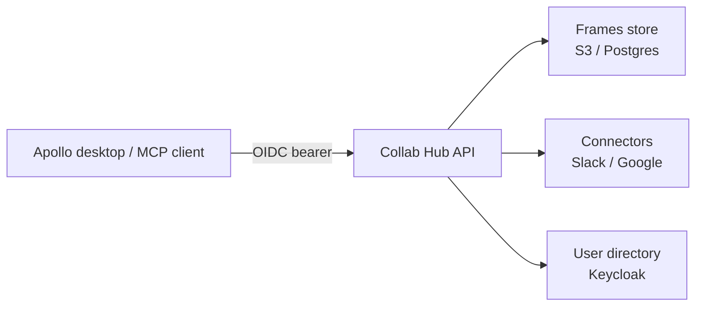

# Collab Hub


[](https://github.com/nebari-dev/collab-hub-pack/actions/workflows/lint.yaml)
[](https://github.com/nebari-dev/collab-hub-pack/actions/workflows/test.yaml)

> **Beta** — stable enough to deploy in your own environment with engineering
> support. APIs and chart values may still change between releases. See the
> [maturity levels](docs/release-readiness-checklist.md).

The intelligence and integration backend for AI-assisted collaboration on
[Nebari](https://nebari.dev). Collab Hub is a [Nebari software
pack](https://github.com/nebari-dev/software-pack-template): a Kubernetes
application that installs on a Nebari cluster with routing, TLS, and OIDC
authentication.

The API is a FastAPI service exposing:

- **Frames** — workspace-scoped saved Markdown context, suggestions, and
  active-frame selection.
- **Connectors** — read access to workspace tools: Slack, Gmail, Google
  Calendar, and Google Drive.
- **User directory** — org/workspace identity resolved from Keycloak.
- **Scheduled tasks**, **usage**, and an **MCP server** exposing the above to
  MCP-speaking clients.

## Prerequisites

- A [Nebari](https://nebari.dev) cluster with the
  [nebari-operator](https://github.com/nebari-dev/nebari-operator) (for the
  `NebariApp` routing/TLS/OIDC integration), or a plain Kubernetes cluster if
  you wire routing yourself.
- [Helm 3](https://helm.sh/docs/intro/install/) and `kubectl`.
- A Keycloak realm for OIDC auth.
- Optional, for persistence: Frame content storage defaults to the local
  filesystem but can use an S3-compatible object store; state/history/tasks
  default to in-memory and can be backed by a Postgres database.

## Quickstart

Install the versioned chart from the latest [release](../../releases/latest)
(pinned to an immutable image):

```sh
helm install collab-hub-pack \
  https://github.com/nebari-dev/collab-hub-pack/releases/download/v0.1.0/collab-hub-0.1.0.tgz \
  --namespace nebari-nexus --create-namespace \
  --values values-example.yaml
```

Or track `main` from a checkout: `helm install collab-hub-pack ./helm/collab-hub …`.

Start from [`values-example.yaml`](values-example.yaml); the full value
reference is [`helm/collab-hub/values.yaml`](helm/collab-hub/values.yaml) and
setup guides are in [`docs/`](docs/) (connectors, standalone deployment, the
web surface).

## Architecture



## Local development

```sh
cd api
uv sync
uv run pytest
uv run python -m collab_hub_api   # DEV_AUTH_USER for unsafe local auth
```

## Documentation

Setup and reference docs — connector setup, Frames, operations — live in
[`docs/`](docs/).

The basis for Cog and Op execution — vocabulary, the Op–Cog seam, the
result envelope, the sensitivity model — is in
[`docs/cog-execution/`](docs/cog-execution/); the decisions behind it are
recorded in [`docs/adr/`](docs/adr/).

## Contributing

See [CONTRIBUTING.md](CONTRIBUTING.md). Contributions are accepted under the
[Apache-2.0 license](LICENSE). Report
security issues privately via GitHub's
[Report a vulnerability](https://github.com/nebari-dev/collab-hub-pack/security/advisories/new).
