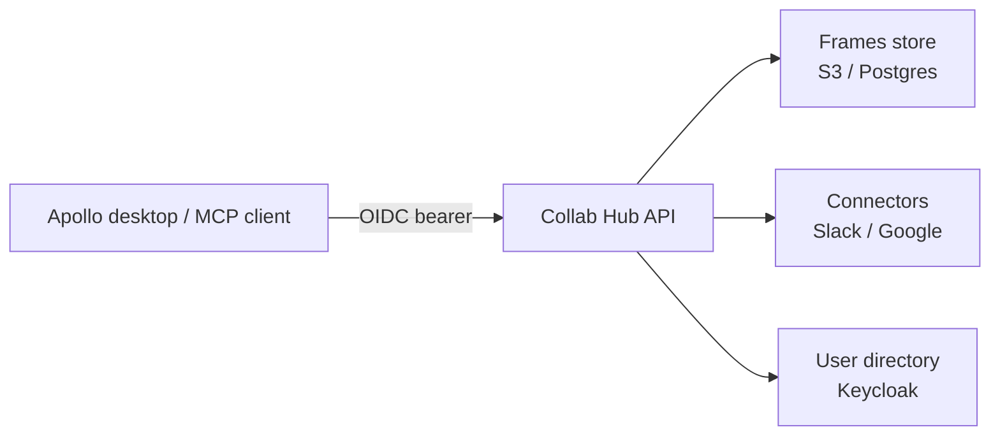

# Collab Hub API

[](https://github.com/nebari-dev/collab-hub-pack/actions/workflows/lint.yaml)
[](https://github.com/nebari-dev/collab-hub-pack/actions/workflows/test.yaml)

The intelligence and integration backend for AI-assisted collaboration on
[Nebari](https://nebari.dev). Collab Hub API is a [Nebari software
pack](https://github.com/nebari-dev/software-pack-template): a Kubernetes
application that installs on a Nebari cluster with routing, TLS, and OIDC
authentication.

The API is a FastAPI service exposing:

- **Frames** — workspace-scoped saved Markdown context, suggestions, and
  active-frame selection.
- **Connectors** — read access to workspace tools: Slack, Gmail, Google
  Calendar, and Google Drive.
- **User directory** — org/workspace identity resolved from Keycloak.
- **Scheduled tasks**, **usage**, and an **MCP server** exposing the above to
  MCP-speaking clients.

## Quickstart

Install the chart onto a Nebari cluster (namespace `nebari-nexus`):

```sh
helm install collab-hub-pack oci://ghcr.io/nebari-dev/collab-hub-pack/charts/collab-hub \
  --namespace nebari-nexus --create-namespace \
  --values my-values.yaml
```

Minimum `my-values.yaml` wires the image, OIDC, and storage; see the
[docs site](https://packs.nebari.dev/collab-hub-pack/) for a working example
and the full value reference.

## Architecture



## Local development

```sh
cd api
uv sync
uv run pytest
uv run python -m collab_hub_api   # DEV_AUTH_USER for unsafe local auth
```

## Documentation

Full docs — quickstart, installation, connector setup, configuration, and
architecture — are published at
[packs.nebari.dev/collab-hub-pack](https://packs.nebari.dev/collab-hub-pack/)
and sourced from [`docs/`](docs/).

## Contributing

See [CONTRIBUTING.md](CONTRIBUTING.md). Contributions are accepted under the
[Apache-2.0 license](LICENSE) with a `Signed-off-by` (DCO) line. Report
security issues privately via [SECURITY.md](SECURITY.md).
