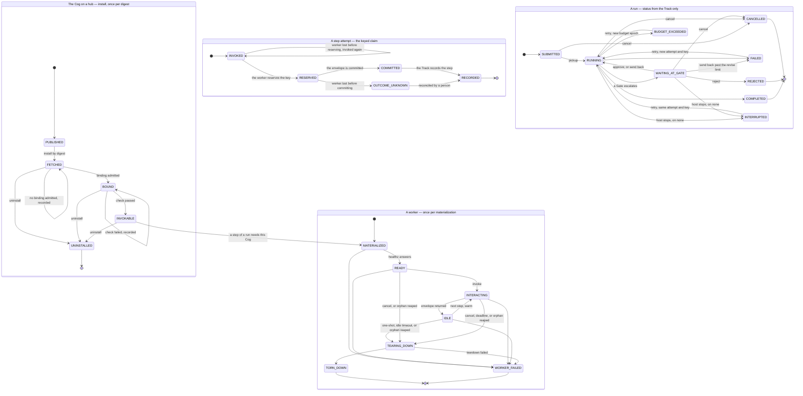

# The states of Cog execution

"The state of a Cog" is four questions, and each has its own small state
machine: is the Cog **installed** on this hub, is a **worker** of it up, what
happened to one **step attempt** on that worker, and where is the **run** that
asked. They nest: only an `INVOKABLE` Cog is materialized, a `RUNNING` run
drives step attempts one at a time, and each attempt holds a worker
`INTERACTING`.

This page is the reference for those machines. The code is
[`collab_hub_execution.states`](../../execution/src/collab_hub_execution/states/),
and a test (`execution/tests/test_states_document.py`) holds this page to it:
the diagram's transitions, its initial and final states, and the rows of the
state table below must equal the machines'. A transition added here and not
there, or there and not here, fails CI.

## The diagram

## The states

| State | Of | Meaning | Reached through |
|---|---|---|---|
| `PUBLISHED` | the Cog | The package is in a registry the catalog indexes, addressable as `<host>/<repo>@<digest>`; nothing of it is on the hub yet. A development package read from a directory has no install states: it is materialized straight from its directory. | ADR-0001 D6; #7 |
| `FETCHED` | the Cog | Install has pulled the package and provisioned its environment. Not invokable. A binding that cannot be admitted leaves it here, recorded. | glossary, *Install*; #106 |
| `BOUND` | the Cog | Its requirements are resolved and the binding admitted. A failing `check` leaves it here, with the failing step recorded. | #106, #3 |
| `INVOKABLE` | the Cog | `check` passed against the delivered binding and the catalog card is recorded; a run may name the digest. Installing starts no worker. | glossary, *Install*; ADR-0001 D5 |
| `UNINSTALLED` | the Cog | The install and every runtime resource it created are removed, its warm pool drained. Reachable from every state in which the install holds something on the hub — `FETCHED`, `BOUND`, `INVOKABLE` — so an install stuck before `INVOKABLE` can be removed. A `PUBLISHED` Cog has nothing on the hub to remove. | #106, #4 |
| `MATERIALIZED` | a worker | The executor has brought up the package's `serve` — a child process or a pod — and it is not answering yet. | glossary, *Materialize / worker* |
| `READY` | a worker | `/healthz` answers; the worker can take an `/invoke`. | #1 |
| `INTERACTING` | a worker | An `/invoke` is in flight. Cancellation and the duration deadline act here. | #1, #4 |
| `IDLE` | a worker | The envelope is back. A warm worker waits here for the next step until its idle timeout; a one-shot worker leaves at once. | #4 |
| `TEARING_DOWN` | a worker | The executor is reclaiming it — after a one-shot step, an idle timeout, a cancel, or the duration deadline cutting an interaction short. Also how an orphan is reaped when the next controller starts. | #109, #121, #6 |
| `TORN_DOWN` | a worker | Gone. Never recorded: the Track records a teardown that failed, not one that worked. | #1 |
| `WORKER_FAILED` | a worker | Materialization, readiness, an interaction or teardown failed — the last recorded as `teardown_failed`. Terminal for this worker; the run decides what follows. | #1 |
| `INVOKED` | a step attempt | The controller has sent the task with the attempt's idempotency key. A worker lost before reserving is simply invoked again under the same key: nothing has acted. | #102 |
| `RESERVED` | a step attempt | The worker reserved the key before acting. | #102; ADR-0002 D1 |
| `COMMITTED` | a step attempt | The worker committed its envelope; any replay of the key returns that envelope without acting again. | #102 |
| `RECORDED` | a step attempt | The Track holds `step_completed` or `step_failed` for the attempt. | #5 |
| `OUTCOME_UNKNOWN` | a step attempt | The key was reserved and never committed: the worker was lost between the side effect and its result. Nothing acts again, an ordinary retry is refused, and a person — or an entry point the Cog declares idempotent — reconciles it. | #102, #103 |
| `SUBMITTED` | a run | The submission is recorded; no controller has picked the run up. | #121 |
| `RUNNING` | a run | A controller owns it and is advancing its steps. The worker's own states are not the run's: a run between steps, or with a worker idling, is `RUNNING`. | #121 |
| `WAITING_AT_GATE` | a run | A step escalated, and the run waits for a decision naming the open escalation. A send back re-runs the step, bounded by the revise limit: a limit of N allows N revisions, and past it the run ends `FAILED` with error `revise_limit_exceeded`. Until step-declared Gates (#99), it is a Cog's pause that escalates. | #99, #103 |
| `COMPLETED` | a run | Every step completed, and every Gate passed or was approved. Final. | #2 |
| `FAILED` | a run | A step's envelope came back `ok: false`, its worker failed, a step attempt ended `OUTCOME_UNKNOWN`, or a send back went past the revise limit — each recorded with its reason. Retry runs a recorded failure as a new attempt under a new key. | #101 |
| `REJECTED` | a run | A reviewer rejected at a Gate. Final. | #99 |
| `CANCELLED` | a run | A client cancelled, before pickup or after: any worker is torn down and the actor recorded. Final. | #101 |
| `BUDGET_EXCEEDED` | a run | A budget dimension — `duration`, `tokens` or `cost` — stopped it. Retry opens a new budget epoch. | #4 |
| `INTERRUPTED` | a run | Its host stopped under `none`, which cannot resume; recorded when the host next starts. Retry continues the attempt in flight under its existing key. Under `dbos` and `temporal` a host stop leaves the run `RUNNING` or `WAITING_AT_GATE`, and it resumes. | glossary, *Interrupted*; ADR-0002 D2; #101 |

## The events

Each machine's events are the methods of its context object. An event names
what happened; the state decides where that leads. What a transition records
goes where its machine's facts are kept: a run's and a worker's to the run's
Track, a step attempt's to the claim store (#102), an install's to the install
record (#106).

**The install** — `CogInstall`

| Event | From → to | Records |
|---|---|---|
| `fetch()` | `PUBLISHED` → `FETCHED` | `install_fetched` |
| `admit_binding(binding)` | `FETCHED` → `BOUND` | `binding_admitted` |
| `refuse_binding(reason)` | `FETCHED` → `FETCHED` | `binding_refused` |
| `check_passed()` | `BOUND` → `INVOKABLE` | `check_passed` |
| `check_failed(step, reason)` | `BOUND` → `BOUND` | `check_failed` |
| `uninstall()` | `FETCHED`, `BOUND`, `INVOKABLE` → `UNINSTALLED` | `uninstalled` |

`require_invokable()` refuses to materialize a worker of an install that is not
`INVOKABLE` — the one move between machines.

**A worker** — `Worker`, created by `Worker.materialize(cog, step=, digest=, install=)`, which records `materialized`

| Event | From → to | Records |
|---|---|---|
| `ready()` | `MATERIALIZED` → `READY` | `ready` |
| `invoke(entry_point, step)` | `READY`, `IDLE` → `INTERACTING` | `interaction_started` |
| `envelope_returned()` | `INTERACTING` → `IDLE` | `idle` |
| `tear_down(reason)` | `READY` (`cancel`, `orphan_reaped`), `INTERACTING` (`cancel`, `deadline`, `orphan_reaped`), `IDLE` (`one_shot`, `idle_timeout`, `orphan_reaped`) → `TEARING_DOWN` | `teardown_started` |
| `torn_down()` | `TEARING_DOWN` → `TORN_DOWN` | — |
| `fail(error)` | `MATERIALIZED`, `READY`, `INTERACTING`, `IDLE` → `WORKER_FAILED`; `TEARING_DOWN` → `WORKER_FAILED` | —; `teardown_failed` |

**A step attempt** — `StepAttempt(key)`, which starts `INVOKED`

| Event | From → to | Records |
|---|---|---|
| `worker_lost()` | `INVOKED` → `INVOKED`; `RESERVED` → `OUTCOME_UNKNOWN` | `step_reinvoked`; `outcome_unknown` |
| `reserve()` | `INVOKED` → `RESERVED` | `claim_reserved` |
| `commit()` | `RESERVED` → `COMMITTED` | `claim_committed` |
| `record()` | `COMMITTED` → `RECORDED` | — (the Track's `step_completed` or `step_failed` is the record) |
| `reconcile(actor)` | `OUTCOME_UNKNOWN` → `RECORDED` | `outcome_reconciled` |

**A run** — `Run`, created by `Run.submit(run_id, op)`, which records `op_submitted`

| Event | From → to | Records |
|---|---|---|
| `pickup()` | `SUBMITTED` → `RUNNING` | `run_picked_up` |
| `escalate(step, reason, escalation, revise_limit)` | `RUNNING` → `WAITING_AT_GATE`; → `FAILED` when the step has already been revised `revise_limit` times | `paused`; `failed` |
| `decide(outcome, escalation, findings, revise_limit)` | `WAITING_AT_GATE` → `RUNNING` (approve; send back), `REJECTED` (reject), `FAILED` (send back past the revise limit) | `signal_received`; `rejected`; `failed` |
| `complete()` | `RUNNING` → `COMPLETED` | `completed` |
| `fail(error, step, reason, details)` | `RUNNING` → `FAILED` | `failed` |
| `exhaust_budget(dimension, step, reason)` | `RUNNING` → `BUDGET_EXCEEDED` | `timed_out` for `duration`; `budget_exceeded` otherwise |
| `cancel(actor)` | `SUBMITTED`, `RUNNING`, `WAITING_AT_GATE` → `CANCELLED` | `cancelled` |
| `host_stopped(backend)` | `RUNNING`, `WAITING_AT_GATE` → `INTERRUPTED`, under `none` only | `interrupted` |
| `retry()` | `FAILED` → `RUNNING` (new attempt); `INTERRUPTED` → `RUNNING` (same attempt); `BUDGET_EXCEEDED` → `RUNNING` (new budget epoch) | `retry_requested` |

The run's records keep the Track's current event names — `paused` for an
escalation, `signal_received` for a decision, `timed_out` for a duration stop.
Track event schema v1 (#5) renames them; the states do not change.

## How the code holds them

**The state pattern.** Each machine has an interface class — `InstallState`,
`WorkerState`, `StepAttemptState`, `RunState` — with one method per event,
every one refusing by default. Each state is a class that overrides the events
it accepts, and one instance of it stands for the state: `RunState.RUNNING`.
The context object holds the data and delegates every event to its current
state. An event the state does not accept raises `InvalidTransition`, naming
the state and the event; a guard that refuses raises it too, with its reason.
An illegal move fails loudly; it never becomes a status.

**Declared transitions.** Each accepted event declares the states it may lead
to (`@accepts("RUNNING", "REJECTED", "FAILED")`). Those declarations are the
machine's transitions: the document test compares them with the diagram, and
every transition a handler returns is checked against them.

**Pure transitions.** A transition takes an event and returns a
`Transition(after, records)`: the context after it, and what to record. It
performs no I/O, reads no clock and calls no executor, and the context before
it is unchanged. Whoever applies the transition writes the records, so every
durability backend moves the same machines.

**Guards live in the state that owns them.** A decision must name the open
escalation (`StaleEscalation` otherwise). A revise limit of N allows N
revisions: a send back that would produce revision N+1 ends the run `FAILED`
instead. The engine does not apply the limit at the decision yet — #35's
`signal()` cannot say whether it approves or sends back, so charging every
signal would fail runs an approval completes — but when the step escalates
again after N revisions, as #35 did; step-declared Gates (#99) move it to the
decision. Retry from `INTERRUPTED` keeps the attempt, from `FAILED`
opens a new one, from `BUDGET_EXCEEDED` a new budget epoch. `host_stopped` is
refused under a backend that resumes. A cancellation and a reconciliation name
who made them, and a worker is torn down only for a reason its state allows.

**Status from the Track.** A run's status is its Track replayed through the run
machine (`Run.replay`, and `derive_run_status` over a Track). Each run record
above moves the run on replay through the same handler as it did live, with the
arguments the Track recorded, and must record what was recorded: the same
event, with the same outcome, attempt, error and dimension. A step's and a
worker's facts — `step_started`, `materialized`, `ready`,
`interaction_started`, `interaction_usage`, `idle`, `teardown_started`,
`teardown_failed`, `step_completed` — leave the run where it is. Anything else
raises `InvalidTransition` instead of becoming a status: an event no run
records, a second submission, a `signal_received` that rejects, a revise-limit
stop its recorded limit does not produce. The older `submitted` is read as
`op_submitted`, and a Track with no `run_picked_up` at all, written before
pickups were recorded, reads its first step start or run event as the pickup.

**A worker that cannot be reclaimed.** A worker that answered and then fails to
tear down records `teardown_failed` through its machine. One that did not answer
has already failed; the executor still reclaims it, and if that fails the run's
`failed` record says so — `TeardownFailed`, with the worker's own error beside
it — since cleaning up a failed worker is not a move of its machine.

**Wire values.** A state is sent as its name in lower case: `waiting_at_gate`.
`RUN["waiting_at_gate"]` reads one back. #35's engine reported a paused run as
`paused` and a duration stop as `timed_out`; those are now `waiting_at_gate` and
`budget_exceeded`, and the worker's states — `materialized`, `ready`,
`interacting`, `idle`, `tearing_down` — are no longer reported as a run's.
