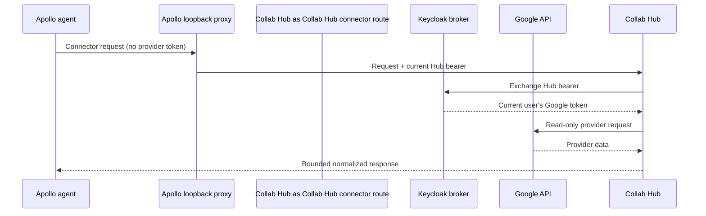

# Google Workspace Connectors: Collab Hub Implementation Guide

This document is the entry point for contributors working on the read-only
Google Drive, Gmail, and Google Calendar connectors in Collab Hub. Provider-specific
setup remains in:

- [Google Drive](google-drive-connector.md)
- [Gmail](gmail-connector.md)
- [Google Calendar](google-calendar-connector.md)

Use the code map and validation section below as the review entry point.

## Security and runtime boundary

Collab Hub receives the user's Hub bearer and exchanges it with Keycloak for that
same user's brokered Google token. Only Collab Hub calls Google. Provider tokens are
never returned in REST responses, written to connector logs, forwarded to
Apollo's webview, or placed in model context.



## Code map

| Path | Responsibility |
| --- | --- |
| [`api/src/collab_hub_api/connectors/google_tokens.py`](../api/src/collab_hub_api/connectors/google_tokens.py) | Per-request Keycloak broker token retrieval and connector-state errors. |
| [`api/src/collab_hub_api/connectors/models.py`](../api/src/collab_hub_api/connectors/models.py) | Public request/response models, limits, connector IDs, and read-only scopes. |
| [`api/src/collab_hub_api/connectors/drive_client.py`](../api/src/collab_hub_api/connectors/drive_client.py) | Google Drive provider calls and file normalization. |
| [`api/src/collab_hub_api/connectors/gmail_client.py`](../api/src/collab_hub_api/connectors/gmail_client.py) | Gmail search, metadata expansion, MIME text extraction, and page-token forwarding. |
| [`api/src/collab_hub_api/connectors/calendar_client.py`](../api/src/collab_hub_api/connectors/calendar_client.py) | Calendar discovery, bounded multi-calendar search, opaque cursors, and event normalization. |
| [`api/src/collab_hub_api/connectors/connector_text.py`](../api/src/collab_hub_api/connectors/connector_text.py) | Shared link sanitization workaround for Apollo renderer issue `apollo-desktop#365`. |
| [`api/src/collab_hub_api/routers/connectors.py`](../api/src/collab_hub_api/routers/connectors.py) | Authenticated REST routes, status probes, error mapping, and response construction. |
| [`api/src/collab_hub_api/config.py`](../api/src/collab_hub_api/config.py) | Broker URL, Google API base URLs, static test token, and timeout settings. |
| [`helm/collab-hub/values.yaml`](../helm/collab-hub/values.yaml) | Deploy-time connector configuration. |
| [`helm/collab-hub/values.schema.json`](../helm/collab-hub/values.schema.json) | Helm validation for supported connector values. |
| [`helm/collab-hub/templates/api-deployment.yaml`](../helm/collab-hub/templates/api-deployment.yaml) | Maps Helm values to Collab Hub API environment variables. |
| [`api/tests/test_google_workspace_connectors.py`](../api/tests/test_google_workspace_connectors.py) | Gmail/Calendar contract, pagination, token, sanitization, and failure-mode tests. |
| [`api/Dockerfile`](../api/Dockerfile) | Reproducible API image, non-root runtime, and system `libpq` needed by the pure-Python psycopg package. |
| [`scripts/testdata/fake_google_drive_app.py`](../scripts/testdata/fake_google_drive_app.py) | Fake broker plus Drive, Gmail, and Calendar provider endpoints, including paginated 2021/2023 MIME messages. |
| [`scripts/smoke_connectors_google_workspace.py`](../scripts/smoke_connectors_google_workspace.py) | Live HTTP Gmail/Calendar smoke assertions, including bounded historical search and read. |
| [`scripts/smoke_local_collab_hub_features_kind.sh`](../scripts/smoke_local_collab_hub_features_kind.sh) | Builds the chart boundary and runs all connector smoke clients in kind. |

## Public contracts

All routes live below `/v1/connectors` and are read-only.

| Connector | Status | Search | Read |
| --- | --- | --- | --- |
| Drive | `GET /google-drive/status` | `POST /google-drive/search` | `POST /google-drive/files/{file_id}/read` |
| Gmail | `GET /gmail/status` | `POST /gmail/search` | `POST /gmail/messages/{message_id}/read` |
| Calendar | `GET /google-calendar/status` | `POST /google-calendar/search` | `POST /google-calendar/calendars/{calendar_id}/events/{event_id}/read` |

The Gmail and Calendar status routes are provider capability probes, not merely
checks that Keycloak returned some token. Gmail executes a bounded
`users.messages.list` request with `q`; Calendar executes bounded
`calendarList.list` and `events.list` requests. These are the same capabilities the
tools need, so profile-only or calendar-list-only grants report
`reconnect_required` instead of failing on the first search. Drive retains its
existing broker-availability status behavior.

## Request lifecycle by layer

1. `routers/connectors.py` authenticates the Hub request and validates the
   public Pydantic request model.
2. `google_tokens.py` retrieves the current user's provider token from the
   Keycloak broker for that request; Collab Hub does not cache a shared Google user.
3. The provider client builds the Google request and converts provider-specific
   payloads into the public models in `models.py`.
4. `connector_text.py` removes link-shaped text where required by the temporary
   Apollo renderer workaround.
5. The router returns only bounded normalized data and maps known failure types
   to a stable HTTP status.

The router deliberately does not parse Gmail MIME bodies or manage Calendar
cursors. Those responsibilities remain in their provider clients, where they
can be tested without involving FastAPI authentication or response wiring.

## Pagination stability rules

Gmail exposes Google's `nextPageToken` as `next_page_token`. The caller repeats
the same filters and sends it back as `page_token`.

Calendar searches can span many calendars, so Collab Hub returns its own opaque
`next_cursor`. That cursor records:

- a fingerprint of the caller's filters;
- the resolved concrete UTC time window;
- the resolved IANA timezone;
- the selected-calendar signature; and
- the last globally emitted event sort key.

Every selected calendar contributes ordered candidates before Collab Hub emits a
page. This keeps all pages globally chronological, prevents relative windows
from drifting, and rejects stale or filter-mismatched continuations with HTTP
422. Provider token cycles and overlong pagination fail with HTTP 502 instead
of looping or returning silently duplicated pages.

## Friendly dates and timezone rules

Both searches accept an IANA `time_zone`. Apollo supplies the desktop timezone.
Calendar falls back to the primary calendar's timezone when it is omitted.
Calendar date bounds are resolved at local midnight and then converted to UTC.
Gmail date bounds are converted to epoch seconds before being placed in `q`, so
Gmail cannot reinterpret them using its default PST date semantics. Filter-only
Gmail searches are supported when `label_ids`, `days_back`, `since_date`, or
`until_date` is present; a completely unbounded empty request is rejected.

## Failure mapping

| Condition | Response | Why |
| --- | --- | --- |
| Google is not linked | 409 on tool routes; `not_connected` on status | The user must complete the broker link. |
| Stored grant lacks Gmail/Calendar scope | `reconnect_required` on status | The user must consent to the expanded read-only scope. |
| Invalid, stale, or filter-mismatched Calendar cursor | 422 | The caller can restart the search with valid input. |
| Provider timeout, invalid JSON, non-2xx response, or pagination cycle | 502 | Collab Hub received a bad or unavailable upstream response; raw bodies and tokens are not returned. |
| Valid search with no matches | 200 with an empty list | Empty results are not an error. |

## Output normalization

- Every data-bearing response includes `content_trust: external_untrusted` and
  a security notice telling agents never to follow instructions in provider
  content.
- Read bodies are bounded by `max_chars` and report `truncated`.
- Gmail ignores attachments, prefers `text/plain`, and falls back to text
  extracted from HTML.
- Calendar normalizes timed/all-day shapes, attendee response status,
  recurrence identity, original occurrence time, attachment metadata, and
  event type.
- Connector text removes explicit URLs, Markdown targets, bare domains, and
  clickable email forms until Apollo renderer issue #365 is fixed. Calendar
  `htmlLink`, attachment URLs, and Drive `webViewLink` are intentionally absent
  from public models.
- Provider access tokens must never appear in responses or log context.

## Validation paths

Run the API and contract suite:

```bash
cd api
uv run --group test pytest -q tests
cd ..
uvx ruff check \
  api/src api/tests \
  scripts/smoke_connectors_google_workspace.py \
  scripts/testdata/fake_google_drive_app.py
helm lint helm/collab-hub
```

Run only the Google Workspace stability cases repeatedly:

```bash
cd api
for run in 1 2 3 4 5; do
  uv run --group test pytest -q tests/test_google_workspace_connectors.py
done
cd ..
```

With the fake provider and Collab Hub API running locally, exercise the real HTTP
route, broker exchange, provider client, historical pagination, and MIME parsing:

```bash
cd api
uv run --group test python ../scripts/smoke_connectors_google_workspace.py \
  --base-url http://127.0.0.1:18084
```

This includes a 2020–2023 Gmail search whose first page is an HTML-only 2023
message and whose second page is a multipart 2021 message with a PDF attachment.
The smoke test reads both messages and asserts URL sanitization, attachment
exclusion, forward pagination, and token non-disclosure. The client prints each
completed assertion group, so its terminal output is the review artifact for a
live run.

Exercise the packaged Helm boundary with fake broker/provider services in a
local kind cluster:

```bash
scripts/smoke_local_collab_hub_features_kind.sh
```

That script deploys the fake providers, installs the chart, and runs the Drive,
Gmail, Calendar, and Slack smoke clients through real HTTP service boundaries.

Exercise the production storage drivers through real Postgres and MinIO/S3
services in the same kind cluster:

```bash
scripts/smoke_frames_postgres_active_state.sh
scripts/smoke_frames_minio_s3.sh
```

## Change checklist

When changing a Google connector:

1. Update the Pydantic models and OpenAPI contract in `models.py`.
2. Keep provider-specific normalization in its client, not in the router.
3. Map caller-correctable input/cursor errors to 422 and provider failures to
   502 without returning provider tokens.
4. Update both the focused pytest file and the fake-provider smoke path.
5. Update the provider-specific Markdown document and this code map if paths or
   behavior changed.
6. Verify Apollo's normal ChatAgent and Hermes plugin accept any new request or
   response continuation fields.
